# TradingAgent Full Audit & Diagnostic Report

**Audit date:** 2026-06-22 (Asia/Singapore)  
**Audited repository:** `/Users/elijahang/Projects/TradingAgent`  
**Audit type:** Read-only technical, operational, security, and runtime audit, except for this report and the requested ignored Excel export.  
**Safety constraint:** No orders, proposals, Telegram messages, config changes, threshold changes, or launchd changes were made.

> Historical snapshot: this report describes the 2026-06-22 audit state and is
> not the current configuration or runtime authority. For current behavior see
> [CONFIGURATION_AND_SIZING.md](CONFIGURATION_AND_SIZING.md) and
> [SYSTEM_OVERVIEW.md](SYSTEM_OVERVIEW.md). Current profitability evidence and
> realized attribution semantics are documented in
> [PROFITABILITY_VALIDATION_AND_ATTRIBUTION.md](PROFITABILITY_VALIDATION_AND_ATTRIBUTION.md).

## 1. Executive Summary

TradingAgent is active, running from the correct Projects path, connected to Alpaca Paper and Telegram, scheduled by launchd every 10 minutes, and currently configured for paper trading. The Git working tree was clean before this audit, `main` was synchronized with `origin/main`, and the remote was the expected `git@github.com:Elijah-Ang/Plutus.git`.

Current safety is **Needs attention**, not Critical. Live trading is disabled in current config, auto-execution is disabled, there are no open positions or open orders, and all 72 tests pass. The strongest safeguards are the paper client default, Telegram authorization/parser, proposal expiry, one-time approval consumption, final deterministic risk evaluation, unique proposal/order constraints, AC/market preflight checks, and ignored runtime data.

The main concerns are latent rather than evidence of an unsafe order:

1. Final risk context hard-codes daily loss, weekly loss, margin use, internet, broker availability, and Telegram availability instead of deriving all values from authoritative runtime state. Several advertised gates are therefore incomplete.
2. Live operation is not permanently hard-disabled in code; setting three values in one YAML file can initialize a live client. Current values are safe, but documentation overstates the guarantee.
3. A disabled paper auto-execution design exists and intentionally bypasses human Telegram approval when enabled. The current implementation appears to fail closed because of proposal-state handling, but the design contradicts statements that manual approval is always mandatory.
4. A stale, older Git clone remains at `/Users/elijahang/Desktop/TradingAgent`. Nothing active references it, but it creates operator-confusion risk.
5. Database order/fill/position reporting is not reconciled from Alpaca after submission. Alpaca reports two historical filled paper orders while local `orders` rows remain `PENDING_NEW`, and local `fills` is empty.

No current Critical issue was found. No secret-value pattern was detected in tracked files, Git history, logs, SQLite, or the generated workbook. A local mode-600 `.env` contains credentials in addition to equivalent Keychain entries, which is secure enough for local use but duplicates secret storage.

## 2. Current System State

| Item | Current state |
| --- | --- |
| Active path | `/Users/elijahang/Projects/TradingAgent` |
| Old Desktop copy | Present, stale at commit `e15a5a1`; not referenced by active tracked files or launchd |
| GitHub remote | `git@github.com:Elijah-Ang/Plutus.git` |
| Branch/upstream | `main` / `origin/main`, 0 ahead and 0 behind before report creation |
| Latest audited commit | `16cb9a8 Add 30-minute Telegram market digest` |
| macOS | 26.5.1, build 25F80 |
| Script shell | Primarily `/bin/zsh`; a few helpers use Bash |
| Python | 3.13.9 in `/Users/elijahang/Projects/TradingAgent/.venv` |
| Dependency health | `.venv` works; `pip check` reports no broken requirements |
| Trading mode | `paper` |
| Live enabled | `false` |
| Explicit live confirmation | `false` |
| Paper auto-execution | Disabled; mode `manual_only` |
| Active tradable watchlist | SPY, QQQ, DIA, IWM |
| Observation symbols | XLK, XLF, XLV, XLE, XLY |
| SGX/HKEX | Placeholder observation profiles, no broker, no proposals, no execution |
| Scheduler | launchd label `com.elijah.tradingagent`, every 600 seconds |
| launchd status | Loaded, idle between cycles, 163 recorded launches, last exit 0 |
| Digest | Enabled, 30-minute interval, market-open only, GPT disabled |
| GPT model | `gpt-5.4-mini`, low default reasoning, medium risk-review setting |
| Alpaca | Paper endpoint confirmed, account active |
| Paper cash | $99,999.98 at audit time |
| Paper buying power | $399,999.92 at audit time |
| Open positions | 0; no dangling SPY position |
| Open orders | 0 |
| Broker order history | 2 records; both filled paper orders |
| Local order history | 2 rows, both stale as `PENDING_NEW`; no fill rows |
| Latest tests | 72 passed, 1 dependency deprecation warning |
| Latest Excel export | `data/exports/trading_agent_report_2026-06-22.xlsx` |

These account and runtime values are local audit data and are why this report must not be pushed without redaction.

## 3. Architecture Map

```mermaid
flowchart LR
    L["launchd every 600 seconds"] --> R["scripts/run_once.sh lock"]
    R --> M["app.main one bounded cycle"]
    M --> P["preflight: kill switch, AC, internet, DB, broker, Telegram, OpenAI, market clock"]
    P -->|pass| S["TradingService"]
    P -->|fail| B["blocked run in SQLite/logs"]
    S --> E["expire and notify stale proposals"]
    S --> T["poll Telegram updates"]
    S --> C["scan Alpaca US universe"]
    C --> MM["market snapshots, indicators, signals, market_memory"]
    MM --> SC["asset and trade scores"]
    SC --> G["optional throttled GPT review"]
    SC --> D["30-minute informational digest"]
    G --> TP["Telegram paper proposal"]
    TP --> A["authorized unambiguous approval"]
    A --> F["consume approval and final risk revalidation"]
    F -->|pass| O["Alpaca Paper order"]
    F -->|fail| N["blocked or unknown, no blind retry"]
    O --> DB["SQLite audit records"]
    DB --> X["Excel export"]
```



The architecture is modular, but `service.py` currently contains scoring, market memory, proposals, Telegram processing, auto-execution design, expiry notifications, and digest generation in one 834-line class. This concentration makes safety review and isolated testing harder.

## 4. File and Folder Audit

### Root files

| File | Purpose | Health |
| --- | --- | --- |
| `README.md` | Entry-level description and quick-start | Stale quick-start path still points to `/Users/elijahang/Documents/Trading/TradingAgent`; otherwise current 10-minute/GPT overview is useful |
| `.gitignore` | Excludes secrets and runtime artifacts | Good for `.env`, DB, exports, logs, caches, models, `.Rhistory`; lacks explicit patterns for raw Telegram-update dumps and locally generated plist copies inside the repo |
| `.env.template` | Placeholder variable names | Safe placeholders only; live confirmation intentionally absent |
| `pyproject.toml` | Python package and dependencies | Healthy; Python >=3.11, tested on 3.13.9 |

### `app/`

Contains all runtime logic. No duplicate app modules were found. `__pycache__` exists locally and is ignored.

| Module | Purpose and connections | Safety/health assessment |
| --- | --- | --- |
| `main.py` | Loads `.env`, config, DB, broker; records config snapshot; runs preflight then one `TradingService` cycle | Healthy bounded-cycle design. Market-closed preflight prevents Telegram commands and expiry notifications from running outside market hours |
| `service.py` | Polling, scanning, scoring, memory, proposals, expiry, optional GPT, digest, approvals, execution | Functional but oversized. Final context includes hard-coded risk values. Auto-execution design exists. Summary logging loses stored no-action reasons and prints `N/A` |
| `preflight.py` | Kill switch, AC, internet, config, DB, lock, mode, broker, Telegram, OpenAI, market clock, expiry | Good fail-closed entry gate. It mutates stale proposals to expired. Requiring market open blocks non-trading Telegram and expiry work outside hours |
| `risk_engine.py` | Deterministic system, data, universe, portfolio, signal, order, and approval checks | Broad coverage. Daily/weekly loss and margin checks depend on context values that service currently hard-codes. Live gate accepts config-based live enablement |
| `broker_interface.py` | Broker abstraction | Clear minimal interface; lacks `get_clock` used opportunistically by service and lacks a read/reconcile fills method |
| `broker_alpaca.py` | Alpaca trading/data clients, paper default, orders and market clock | Paper endpoint confirmed. Live is possible if three config gates are changed. `TEST` symbol returns a mock response in-process. No order polling/reconciliation |
| `execution.py` | Requires approved proposal, creates client ID, final risk evaluation, submits once | Good no-blind-retry behavior. Unknown transport result is marked manual-review. Does not poll or persist final fill state |
| `storage.py` | WAL SQLite schema, migrations, checks, proposal expiry, atomic approval consumption | Integrity is good. Migrations are ad hoc `ALTER TABLE` checks rather than versioned migrations. No foreign-key declarations despite `PRAGMA foreign_keys=ON` |
| `telegram_bot.py` | Bot API, send/getUpdates, authorization, commands | `getMe` connectivity passed. Dangerous commands require authorization; resume requires exact paper phrase. `/status`, `/report`, etc. are static text rather than live data |
| `approval_parser.py` | Parses yes/no variants, proposal prefixes, symbols, sides, authorization, expiry | Healthy and well tested. Rejection itself requires exactly one matched pending proposal, which is conservative |
| `ai_review.py` | Redacts proposal, uses Responses API, validates structured JSON, deterministic fallback | GPT has no broker object and cannot execute. Fallback is safe. Internal key name `max_calls_per_run` differs from config `ai_max_calls_per_run`, but service separately enforces the configured cap |
| `reports.py` | Generates an 18-sheet workbook from SQLite | Export works quickly and required sheets exist. It exports raw approval messages and proposal/config payloads, creating privacy risk if users ever paste a secret into Telegram |
| `utils.py` | Config, Keychain retrieval, redaction, SGT formatting, proposal/digest text | Proposal format contains mode, scores, confidence, rank, changes, GPT status, caution, decision time, SGT expiry, yes/no, and no-reply behavior. `mode_notice` is computed but not included |
| `strategy_rule_based.py` | MA/volatility entry/exit/HOLD rules | Deterministic. Current 5% annualized volatility threshold is extremely restrictive relative to `features.py` annualization and is responsible for current HOLD reasons |
| `features.py` | Returns, MAs, annualized volatility, volume change | Straightforward. Confirms the strategy threshold is compared to annualized volatility |
| `market_data.py` | Normalizes Alpaca bar frames | Healthy and small |
| `strategy_ml_shadow.py` | Logistic/RF time-ordered train/test and shadow predictions | Execution method always raises; config disabled. Uses a single chronological 80/20 split, not walk-forward despite earlier design goal |
| `cash_manager.py` | Recommendation-only profit allocation | API withdrawal always raises; currently unused runtime tables are empty |
| `power.py` | macOS `pmset` AC detection | Correct fail-closed unknown behavior |
| `internet.py` | TCP check to Alpaca HTTPS | Simple and scoped; not a full Telegram/OpenAI connectivity test |
| `logging_config.py` | Rotating runtime/error logs | Works; no detected secret patterns |

### `config/`

At the historical audit date this contained current tracked behavior and a local ignored kill switch path. The current source of truth is `config/config.yaml`; the former `risk_limits.yaml` reference is historical and there is no active file.

### `data/`

Contains the ignored active SQLite DB, ignored exports, model/cache folders, and backup folder. Database integrity is `ok`. No backup files were present. Active DB is local under Projects, not iCloud. Runtime artifacts are ignored.

### `docs/`

Documentation is substantial. `SYSTEM_OVERVIEW.md` covers architecture, scoring, expiry, market profiles, launchd, safety, and digest. It contains duplicated section 14, old 5-minute language, a stale June 19 state snapshot, and an overstatement that live trading is hard-blocked and every order always requires manual approval. `README.md` has the wrong quick-start path. `GITHUB_WORKFLOW.md` overstates the safe helper as a high-entropy scan.

### `launchd/`

Contains one valid placeholder plist. Installed expansion is at `~/Library/LaunchAgents/com.elijah.tradingagent.plist` and references only the Projects path.

### `logs/`

Runtime and error logs are local and ignored. No secret-value patterns were detected. `launchd.err` contains normal INFO logging because the Python logger writes its console handler to stderr. This is confusing but not a runtime failure.

### `scripts/`

Operational scripts are mostly path-independent. `run_once.sh` is the active launchd command and uses an atomic lock directory. Manual proposal test scripts can create or send proposals and should never be mistaken for unit tests. `get_telegram_updates.sh` prints raw Telegram text, username, chat ID, and user ID to terminal; this is a privacy hazard and raw output is not explicitly ignored.

### `tests/`

Fourteen test files provide 72 passing tests. Coverage is strongest around config safety, parser behavior, expiry, digest, scoring, market profiles, and live defaults. Real launchd scheduling behavior, crash-stale locks, secret scanner behavior, broker reconciliation, and full-session behavior remain unproven.

## 5. Config Audit

### Trading and risk

- `mode: paper`
- `live_enabled: false`
- `explicit_live_confirmation: false`
- Maximum paper notional: $5
- Maximum configured live notional: $5
- Maximum trades/day: 1
- Maximum open positions: 1
- Margin, shorting, options, and crypto: disabled
- Fractional orders: allowed
- Final revalidation: required
- Allowed order types: market and limit
- Price freshness: 120 seconds
- Minimum history: 50 bars
- Daily loss stop: $5; weekly loss stop: $10

Current values are conservative. However, daily/weekly loss gates are not effective because service supplies zero rather than calculated P&L, and margin use is always supplied as false.

### Market universe and hours

- Active US tradable ETFs: SPY, QQQ, DIA, IWM.
- Observation-only US sector ETFs: XLK, XLF, XLV, XLE, XLY.
- SGX `ES3.SI` and HKEX `2800.HK` profiles have no broker, execution false, and proposals false. Service logs `data_source_missing` and skips them.
- Risk engine blocks symbols not in an active approved watchlist and blocks SGX/HKEX use through Alpaca.
- Alpaca clock controls regular-session gating. Orders use DAY time-in-force and no extended-hours flag, so extended hours and overnight are effectively disabled.
- Juneteenth/holiday behavior has a dedicated test and broker-clock gating. No custom holiday calendar exists; correctness depends on Alpaca clock.
- User-facing time uses SGT formatting. Internal timestamps are UTC.

### Proposal expiry

- Default 15 minutes, bounded 5–20 minutes.
- High volatility 5 minutes; low volatility up to 20 minutes.
- Expiry notifications enabled and one-shot through `expiry_notified` after successful send.
- Final and parser gates block expired proposals.
- Near-close shortening attempts `broker.get_clock()`, but `AlpacaBroker` does not implement that method. The exception is swallowed, so this modifier currently never runs; final market-open validation still blocks execution after close.

### AI/GPT

- Model: `gpt-5.4-mini`.
- Default reasoning: low; risk-review setting: medium, though review currently uses only the default value.
- Review threshold: Trade Decision Score >=65 plus ENTRY/EXIT signal.
- Minimum interval: 30 minutes per symbol.
- Max calls/run: 2 enforced by service; internal reviewer defaults to 5 because of a key-name mismatch.
- Daily call limit: 10.
- AI review on every run: false.
- GPT receives redacted proposal data and no broker object.
- GPT cannot submit, approve, reject, or bypass deterministic risk.
- Digest GPT use: false; the config key is not consulted, but digest code contains no GPT call.

### Telegram/digest

- Approval enabled.
- Plain yes is allowed only when one proposal matches.
- Digest enabled every 30 minutes, market-open only, maximum six symbols, minimum two cycles, observation symbols included.
- Digest has DB-based throttling and no order/proposal creation path.

### Auto-execution

- `auto_execution_enabled: false`
- `auto_execution_mode: manual_only`
- A future `paper_high_confidence_only` path exists with $1 maximum, score 90, one trade/day, no open orders, and final revalidation.
- Live auto-execution is checked and blocked.
- The code compares Trade Decision Score against both asset and trade thresholds instead of using `asset_score` for the asset threshold.
- It synthesizes an authorized approval rather than requiring Telegram. This contradicts the current safety narrative.
- Current state handling appears to prevent actual submission: proposal is inserted as approved, `consume_approval` requires pending, and the in-memory proposal lacks approved status. This fail-closed bug must not be treated as a safety design.

## 6. launchd and Mac Setup Audit

- Label: `com.elijah.tradingagent`.
- Installed: yes, exactly one matching LaunchAgent plist.
- Loaded: yes; idle between triggers is normal.
- Command: `/Users/elijahang/Projects/TradingAgent/scripts/run_once.sh`.
- Working directory: `/Users/elijahang/Projects/TradingAgent`.
- Interval: 600 seconds / 10 minutes.
- Last launchctl exit: 0; 163 launches recorded.
- One bounded Python cycle runs per trigger.
- No duplicate trading/plutus launchd label was detected.
- No stuck app process or active lock directory was detected.

`run_once.sh` uses `logs/runtime/agent.lockdir`. `mkdir` prevents overlap and a shell trap removes it on normal exit, INT, or TERM. A crash, SIGKILL, or power loss can leave a stale directory indefinitely; future triggers silently exit 0 and never self-recover.

Preflight requires AC power, internet to Alpaca, DB writability, credentials, broker reachability, and an open market. The Mac was on AC at audit time. Current AC power settings show system sleep 0 and display sleep 30 minutes, so display sleep is harmless and full system sleep is disabled while on AC. Battery sleep is one minute. launchd does not replay missed cycles in a burst after sleep.

Logs:

- stdout: `logs/runtime/launchd.out`
- stderr/console: `logs/errors/launchd.err`
- application: `logs/runtime/agent.log`
- errors: `logs/errors/errors.log`

Commands:

```zsh
cd /Users/elijahang/Projects/TradingAgent
./scripts/run_once.sh
launchctl print "gui/$(id -u)/com.elijah.tradingagent"
./scripts/stop_agent.sh
./scripts/uninstall_launchd.sh
```

`stop_agent.sh` creates the kill-switch file; it does not unload launchd. Uninstall performs `bootout` and removes the installed plist.

## 7. Broker / Alpaca Paper Audit

Keychain service names are:

- `TradingAgent.ALPACA_API_KEY`
- `TradingAgent.ALPACA_SECRET_KEY`
- `TradingAgent.TELEGRAM_BOT_TOKEN`
- `TradingAgent.OPENAI_API_KEY`

All four entries are present. `.env` also contains all credential variables, is mode 600, owned by the user, ignored by Git, and untracked. No credentials were printed or included here.

Read-only Alpaca results:

- Connection: successful.
- Client mode: paper.
- Paper endpoint: confirmed from client base URL.
- Account: active.
- Cash: $99,999.98.
- Buying power: $399,999.92.
- Open positions: 0.
- Open orders: 0.
- Recent broker orders: 2, both filled.
- No dangling SPY position.

Order safety:

- Normal execution requires proposal status approved and approval context true.
- Final revalidation checks expiry, market, power, DB, duplicate order/position, notional, universe, strategy, price freshness, order type, buying power, unique client ID, and approval marker.
- Duplicate approval consumption is atomic and tested.
- Rejected/expired/unauthorized replies cannot produce an approved proposal.
- Transport exceptions are marked unknown and are not blindly retried.

Weaknesses:

- Live client creation is permitted if mode/live/explicit confirmation are all changed in config.
- Daily/weekly loss and margin data are not authoritative.
- Local order/fill state is not reconciled from Alpaca.
- No account ID was exposed during audit. There is no evidence current keys were exposed; rotation is not required by observed evidence. Rotate immediately if the stale Desktop clone or `.env` was ever shared or synchronized.

## 8. Telegram Audit

Read-only Bot API `getMe` succeeded. Chat ID and allowed user ID are configured; values are redacted. No Telegram message was sent during this audit.

Current real proposal template contains:

- Paper trading mode.
- Buy/sell symbol and amount/quantity.
- Asset Selection Score and label.
- Trade Decision Score and label.
- Full system-confidence wording.
- Rank among active ETFs.
- Change since last check and since market open.
- GPT called/not-called status and main caution.
- Plain-language reason.
- Decision time and 12-hour SGT expiry.
- Yes/no instructions.
- Explicit no-reply means expiry/no order.

It does not use “Test trend logic” for normal proposals. Test-only wording is isolated behind a TEST symbol or explicit test flag.

Expiry notification is one-shot after a successful send and updates `expiry_notified=1`. Current historic expired proposal predates this feature and remains `expiry_notified=0`; the service would notify it on a passing market-open cycle. Because main preflight blocks when the market is closed, expiry notifications are not processed outside market hours.

The 30-minute digest is enabled and has sent one recorded message. It requires market open and at least two cycles, throttles using the last successful digest, uses no GPT, creates no proposal/order, and ends with no-action wording. It is mobile-readable. It can mention that a proposal exists but does not itself ask for a fresh approval.

Safe template previews (not sent and not backed by a new proposal):

```text
Paper trade proposal
Mode: Paper trading only
Action: Buy [SYMBOL]
Amount: $[AMOUNT]
Asset score: [0-100] — [label]
Trade score: [0-100] — [label]
System confidence: [full label]
Rank: #[rank] of [count] active ETFs
Since last check: [+/-x.xx%]
Since market open: [+/-x.xx%]
GPT review: [confidence or Not called]
Main caution: [risk]
Time to decide: [minutes]
Expires: [12-hour SGT]
Reply yes to approve, or no to reject.
No reply = proposal expires and no order is placed.
```

```text
GPT review: Not called. AI review was skipped due to throttling/safety limits.
```

```text
Proposal expired. The [SYMBOL] paper trade proposal expired at [time SGT].
No order was placed. Reason: no yes/no reply before expiry.
```

```text
30-min market digest
US market: Open
Window: [start]–[end] SGT
Mode: Paper trading only
[ranked watched symbols and changes]
Past 30 min actions: Proposals [n] | Orders [n] | GPT calls [n] | Expired [n]
No action needed.
```

Spam controls exist for digests, GPT, proposal signal/score requirements, and one-shot expiry notifications. There is no separate proposal cooldown beyond strategy state, score, risk limits, existing-order/position checks, and GPT throttling.

## 9. OpenAI/GPT Audit

- Current model: `gpt-5.4-mini`.
- Configured default reasoning effort: low.
- Configured risk-review effort: medium, currently not selected by code.
- Max summary words: 180, but this value is not enforced in prompt validation.
- GPT is called only for an ENTRY/EXIT setup over score 65 that is in the active proposal universe and within daily/per-run/per-symbol interval limits.
- Market-closed preflight prevents scans and GPT calls outside regular hours.
- Maximum configured calls/run: 2 through service logic.
- Daily limit: 10 AI review rows.
- Minimum per-symbol interval: 30 minutes.
- Digest does not call GPT.

Structured output requires summary, risks, Telegram message, caution, reasoning notes, `gpt_confidence`, `gpt_caution`, `main_risk`, `supports_system_score`, and reason. Invalid JSON, missing key, timeout, rate error, or other exception produces deterministic paper-safe text.

GPT cannot execute, receive the broker, approve a proposal, alter risk checks, or bypass Python. Proposal redaction covers key/secret/token/password/account_id names. Redaction is key-name based and should be supplemented with a strict allowlist because unexpected sensitive fields could otherwise pass through.

Database state: six AI-review rows exist historically; current market-memory records show `gpt_called=0`, and the latest digest window recorded zero GPT calls.

## 10. Scoring and Market Memory Audit

### Asset Selection Score

Implemented for every scanned Alpaca symbol and stored in `market_memory`. Components total 100:

- Liquidity/volume: 20.
- Trend: 20.
- Volatility sanity: 20.
- Relative strength versus SPY: 15.
- Signal confirmation: 15.
- Data freshness/quality: 10.

Results are ranked across active plus observation symbols. Ranking appears in logs, SQLite, Excel, digest, and proposals. Asset score alone cannot trigger a normal proposal; signal, Trade Decision Score, active watchlist, risk engine, and approval are also required.

### Trade Decision Score

Implemented as a 0–100 sum:

- Strategy signal: 25.
- Asset score bucket: 15.
- Previous-cycle movement (called 10-minute movement): 10.
- Session trend: 10.
- Volatility filter: 15.
- Portfolio safety: 15.
- Data freshness: 10.

Labels are Very strong (90+), Strong (80+), Moderate (65+), Weak/watch (50+), and No action (<50). Missing signal/data generally lowers the score rather than imputing strength.

The “10-minute” comparison simply uses the previous stored symbol row; it does not verify that the row is actually 10 minutes old. Sleep, deploys, or schedule gaps can turn it into a longer-period comparison. The session anchor is the first row after UTC midnight, which generally covers the US session but is not explicitly the Alpaca session open.

### Latest observed behavior

Latest stored run completed at 2026-06-22 23:02 SGT. All symbols were HOLD. No proposal was justified and no symbol crossed the 65 proposal/GPT threshold.

| Symbol | Asset score/rank | Trade score | Signal/reason |
| --- | ---: | ---: | --- |
| XLE | 85 / #1 | 50 | Observation only; not active watchlist |
| SPY | 80 / #2 | 50 | HOLD; volatility unavailable/too high |
| DIA | 80 / #3 | 50 | HOLD; volatility unavailable/too high |
| XLV | 80 / #4 | 50 | Observation only |
| IWM | 72 / #5 | 37 | HOLD; volatility unavailable/too high |
| QQQ | 70 / #6 | 47 | HOLD; below 50-day MA and volatility too high |
| XLF | 70 / #7 | 57 | Highest trade score but observation-only |
| XLK | 57 / #8 | 33 | Observation only |
| XLY | 57 / #9 | 33 | Observation only |

The 5% annualized volatility maximum is likely too restrictive for broad equity ETFs because features annualize daily return volatility using `sqrt(252)`. This explains repeated HOLD outcomes. The audit did not alter the threshold.

## 11. Database and Excel Audit

Database path: `/Users/elijahang/Projects/TradingAgent/data/trading_agent.db`. Size at audit: approximately 1.35 MB. `PRAGMA integrity_check` returned `ok`.

| Table | Rows | Purpose/current state |
| --- | ---: | --- |
| runs | 184 | Cycle history |
| preflight_checks | 2,301 | Health gates |
| market_snapshots | 67 | Current/raw prices |
| indicators | 67 | Strategy indicator values |
| signals | 81 | HOLD/ENTRY/EXIT history |
| market_memory | 67 | Scores/rank/comparisons |
| trade_proposals | 6 | 2 approved, 3 rejected, 1 expired |
| approvals | 14 | Parsed responses; 2 consumed approvals |
| risk_checks | 64 | Proposal/final risk checks |
| ai_reviews | 6 | GPT/fallback records |
| orders | 2 | Historical paper submissions, stale status |
| fills | 0 | Not reconciled from broker |
| positions | 0 | No persisted snapshots |
| telegram_digests | 1 | Latest digest sent |
| errors | 1 | Historic NameError on June 18 |
| audit_events | 16 | Digest/expiry/data-provider events |
| config_snapshots | 183 | Redacted config history |
| cash/model/ML/daily tables | 0 | Not populated |

Schema includes `expiry_notified`, `telegram_digests`, and all market-memory score/confidence/expiry fields. Storage auto-adds missing columns but has no explicit schema version table or migration transaction history.

Excel export completed in 0.16 seconds and produced:

`data/exports/trading_agent_report_2026-06-22.xlsx`

Sheets:

1. Summary Dashboard
2. Proposals
3. Daily PnL
4. Trades
5. Orders
6. Fills
7. Positions
8. Signals
9. Risk Checks
10. AI Reviews
11. Approvals
12. Cash Management
13. ML Shadow Metrics
14. Market Memory
15. Telegram Digests
16. Errors
17. Audit Events
18. Config Snapshot

No secret-value patterns were found across 494 workbook rows. The workbook is ignored by Git. Privacy caveat: raw approval text is included, so future user-entered secrets could be exported even though no current pattern was detected.

## 12. Tests Audit

Command:

```zsh
PYTHONPATH=. .venv/bin/pytest
```

Result: **72 passed, 0 failed, 1 warning in 12.24 seconds**. The warning is a third-party `websockets.legacy` deprecation warning.

Test files:

- `test_ai_review.py`
- `test_approval_parser.py`
- `test_cash_manager.py`
- `test_daytime_and_expiry.py`
- `test_execution.py`
- `test_no_live_trading_by_default.py`
- `test_proposal_upgrades.py`
- `test_reports.py`
- `test_risk_engine.py`
- `test_scoring_and_throttling.py`
- `test_storage.py`
- `test_strategy_rule_based.py`
- `test_telegram_digest.py`
- `test_telegram_messages.py`

Covered:

- Live defaults and paper/live separation.
- Missing/invalid credential failure behavior.
- Approval variants, ambiguity, authorization, expiry, and prefix matching.
- Duplicate approval consumption.
- Final revalidation and pending-proposal block.
- Expiry notifications and dynamic expiry.
- Digest config, wording, throttling, market hours, and Excel sheet.
- GPT call throttling/fallback.
- Deterministic scoring and proposal messages.
- SGX/HKEX profiles and blocked assets.
- Juneteenth broker-clock behavior.
- ML shadow non-execution.
- System overview structure and GitHub workflow document presence.

Not adequately covered:

- Actual launchctl execution, interval behavior, and crash-stale lock recovery.
- `safe_commit_push.sh` behavior and broad secret leak prevention.
- End-to-end broker order reconciliation/fills.
- Real daily/weekly P&L and margin gates.
- Near-close expiry modifier (`get_clock` mismatch).
- Full open-market session and sleep gaps.
- GPT daily call limit across timezone/date boundaries.
- Report/DB privacy if raw Telegram text contains a secret.
- Successful auto-execution path (it should remain disabled until redesigned and independently reviewed).

## 13. Documentation Audit

Good coverage exists for setup, Alpaca, Telegram, OpenAI, launchd, safety, operations, GitHub, and system architecture.

Stale or inaccurate items:

- README quick-start points to `/Users/elijahang/Documents/Trading/TradingAgent`, not Projects.
- README uses a local `file://` link for SYSTEM_OVERVIEW instead of a repository-relative link.
- SYSTEM_OVERVIEW has duplicate section 14.
- SYSTEM_OVERVIEW says “5-minute” in market-memory and power sections although launchd/config are 10 minutes.
- Its current-state checkpoint is June 19 and reports a daily trade count of 2; current broker state is zero positions/orders and historical orders are filled.
- It states all live functions are hard-blocked, but code supports config-enabled live initialization.
- It states no order can occur without manual Telegram approval, but a disabled auto-execution design exists.
- It calls `launchd/` a future template even though launchd is installed and loaded.
- It labels setup, safe commit, backup, and log rotation scripts “read-only” even though they mutate local state or Git.
- GITHUB_WORKFLOW claims high-entropy scanning, but the helper only tests three narrow regex patterns.

Docs correctly cover the 10-minute scheduler, 30-minute digest, scores, expiry notifications, profiles, SGX/HKEX placeholders, Alpaca US policy, live-disabled config, auto-disabled config, launchd commands, and GitHub workflow.

## 14. Security and Safety Audit

| Area | Rating | Assessment |
| --- | --- | --- |
| Secrets | Needs attention | Keychain present; `.env` mode 600 and ignored but duplicates all credentials; scans clean; raw Telegram helper can expose text/IDs |
| Trading safety | Needs attention | Current paper/live/auto config is safe; approval and expiry strong; loss/margin context is not authoritative; live can be enabled by config |
| Operational safety | Needs attention | launchd and lock work; stale lock has no recovery; market-closed preflight blocks non-trading handling |
| AI safety | Good | No broker tool, structured validation, throttles, deterministic fallback, no digest GPT |
| GitHub safety | Needs attention | Clean/pushed repo and ignored runtime files; safe helper has narrow patterns and staged-only limitations |

### Secrets

- Tracked current files: no secret-value patterns detected.
- Git history: no secret-value patterns detected across reachable commits.
- Logs: no detected key/token patterns.
- SQLite: no detected key/token patterns.
- Excel: no detected key/token patterns.
- `.env`: contains credentials, untracked, ignored, mode 600.
- Keychain: four expected secret entries present.
- Installed LaunchAgent: no secrets embedded.

### Trading gates

Current config is paper, live false, explicit confirmation false, one trade/day, one position, $5 maximum, no margin/short/options/crypto, manual approval, expiry, duplicate protection, and final revalidation. Auto-execution is disabled.

### Operational gates

AC, internet, broker, DB, market, and lock preflight checks exist. No catch-up burst occurs. Holiday behavior depends on Alpaca. Full system sleep is currently disabled on AC. Stale locks and incomplete final context need attention.

### AI gates

GPT is advisory, throttled, and has no execution object. Failures fall back safely. An allowlisted payload would be stronger than recursive key-name redaction.

### GitHub helper

`safe_commit_push.sh` runs tests, requires SYSTEM_OVERVIEW, requires staged files, blocks several runtime paths/extensions, scans staged blobs for three regexes, commits, and pushes the current branch.

Limitations:

- Scans staged files only, not untracked files, history, or unstaged changes.
- Regexes do not robustly cover modern OpenAI `sk-proj` forms, Alpaca key IDs, generic high entropy, PEM/private keys, cloud credentials, or arbitrary bearer tokens.
- Filename loop breaks on whitespace/newlines.
- Runtime block list omits models, market cache, raw Telegram dumps, installed plist copies, and arbitrary renamed DB/report files.
- It does not require review of the staged diff.
- Commit/push occur immediately after checks without a final confirmation.

## 15. Current Performance / Observed Behavior

The last seven completed runs took approximately 21–26 seconds each, typically about 23 seconds. The latest ten records contained seven completed open-market cycles and three earlier market-closed blocks. A 36-minute gap occurred between two recent completed runs, showing that 10-minute execution is not guaranteed through sleep/reload/operational gaps; launchd correctly did not burst-replay missed cycles.

Market memory is populating during open sessions. Latest changes and rankings were meaningful at small intraday magnitudes, but Trade Decision Scores remained 33–57 and no active symbol met the 65 threshold. Repeated HOLD reasons were recorded. One 30-minute digest was sent successfully. No recent proposal or GPT call occurred.

Logging correctly records per-symbol no-action reasons, but the profile-level summary prints `N/A` due to not copying `no_action_reason` back into `profile_results`. `launchd.err` is mostly INFO output because console logging targets stderr.

Excel data is readable and exports quickly, but P&L, fills, positions, cash, ML, and daily summary sheets are empty or placeholders. Local order status is stale relative to Alpaca.

## 16. Issues Found

| Severity | Area | Issue | Evidence | Recommended Fix |
| --- | --- | --- | --- | --- |
| High | Risk | Daily/weekly loss, margin, and several connectivity values are hard-coded in final context | `service.py` `_portfolio_context` sets loss 0, margin false, availability true | Derive P&L/margin from broker/account/DB and re-run actual network/service checks at final validation |
| High | Live safety | Live is not permanently hard-blocked; three config flags can enable live client/order path | `broker_alpaca.py` mode gates and `risk_engine.py` mode gate | Add an out-of-band live capability gate, separate credentials, explicit runtime confirmation, and independent tests/review before any live support |
| Medium | Reconciliation | Broker says two orders filled; local orders remain pending and fills are empty | Read-only Alpaca and SQLite comparison | Poll/reconcile orders and fills safely using client order IDs; never resubmit unknown orders |
| Medium | Auto-execution | Disabled code path bypasses Telegram, misuses score, and has inconsistent proposal-state handling | `service.py` `_should_auto_execute` and auto branch | Keep disabled; redesign as a separate paper-only feature with explicit state machine and independent safety review, or remove |
| Medium | Operations | Stale lock can suppress every future run after crash/SIGKILL | `run_once.sh` mkdir/trap lock | Store PID/start time, validate ownership/age, and recover only with safe rules and audit logging |
| Medium | Privacy | Raw Telegram helper prints message text and IDs; raw dumps are not explicitly ignored | `scripts/get_telegram_updates.sh`, `.gitignore` | Redact text by default and ignore `*telegram*update*.json`/diagnostic dumps |
| Medium | Reporting privacy | Excel exports raw approval text and payloads | `reports.py` direct table export | Redact/sanitize selected columns and use an allowlist for export fields |
| Medium | Scheduling flow | Market-closed preflight prevents expiry notifications and Telegram commands | `main.py` returns before `TradingService` | Split non-trading control/expiry processing from market-open scan/execution while keeping order gates closed |
| Medium | Strategy | 5% maximum is compared to annualized volatility, causing repeated HOLD | `features.py`, `strategies.yaml`, latest memory | Validate units with analysis/tests before any threshold change; do not change blindly |
| Medium | Market memory | “10-minute” change uses previous row regardless of age | `service.py` previous-row query | Store/validate elapsed seconds and label actual interval when gaps occur |
| Medium | Duplicate clone | Stale Desktop Git clone can be launched or edited accidentally | Desktop copy at older commit; active path clean | After user review, archive/remove it or add a prominent inactive marker; do not change during this audit |
| Medium | Secret storage | Credentials exist in both Keychain and `.env` | Presence-only audit; `.env` mode 600 and ignored | Prefer one source; retain only non-secret IDs in `.env` if Keychain is authoritative |
| Medium | Git helper | Secret/runtime scan is narrow and staged-only | `safe_commit_push.sh` | Use a maintained secret scanner plus robust path handling and explicit staged diff review |
| Low | Expiry | Near-close expiry modifier calls missing broker method and silently skips | `service.py` calls `get_clock`; interface has no method | Add read-only `get_clock` to interface or use trading client clock explicitly |
| Low | Docs | README and SYSTEM_OVERVIEW have stale paths/5-minute/current-state claims | Documentation audit | Correct docs in a separate safe documentation change |
| Low | Logging | Profile summary loses no-action reason and logs INFO to error file | `service.py` summary and logger console handler | Preserve reasons and separate stdout/stderr logging levels |
| Low | Schema | Migrations are unversioned and foreign keys are not declared | `storage.py` | Add schema versioning and explicit relationships after backup/testing |
| Info | Backups | Backup directory is empty | `data/backups` audit | Schedule and test local SQLite backup/restore; keep active DB local |

No Critical finding was identified.

## 17. Untested / Not Yet Proven

- Full open-market session operation without sleep or deploy gaps.
- A naturally generated real proposal after current scoring changes.
- Real expiry notification for a new proposal during an open session.
- Digest behavior over many consecutive windows and restarts.
- GPT behavior at daily/per-run limits using the real API.
- Final risk behavior using real daily/weekly losses or margin state.
- Order-status/fill reconciliation and accurate P&L reports.
- Crash/stale-lock recovery.
- Safe helper detection of real modern secret formats.
- Live trading safety beyond unit tests; live must remain disabled.
- Successful paper auto-execution; it should not be tested or enabled until redesigned and explicitly authorized.
- SGX/HKEX data, which is intentionally unavailable and skipped.
- ML shadow training persistence in routine operation; related tables are empty.
- Backup and restore procedures.

## 18. Recommended Next Steps

### Immediate safety fixes

1. Replace hard-coded final risk context with authoritative broker/DB values for loss, margin, connectivity, and Telegram availability.
2. Keep live and auto-execution disabled. Strengthen live gating outside the normal YAML file before considering any future live work.
3. Add broker order/fill reconciliation without retrying submissions.
4. Redact approval raw text/payload fields from Excel and make Telegram update helpers privacy-safe.
5. Implement safe stale-lock detection and recovery.

### Short-term validation

1. Add tests for authoritative P&L/margin context, near-close expiry, stale locks, and report redaction.
2. Correct README/SYSTEM_OVERVIEW drift and explicitly document latent live/auto code.
3. Validate volatility units analytically before proposing any threshold change.
4. Add elapsed-time fields to market-memory comparisons.
5. Test database backup and restore.

### Medium-term improvements

1. Split `service.py` into Telegram control, scanner/scoring, proposal, expiry, digest, and reconciliation services.
2. Add versioned SQLite migrations and foreign keys.
3. Replace regex-only Git scanning with a maintained secret scanner.
4. Persist account/position/cash snapshots and build accurate P&L reporting.
5. Remove or archive the stale Desktop clone after explicit user approval.

### Things not to do yet

- Do not enable live trading.
- Do not enable paper auto-execution.
- Do not change the volatility or proposal thresholds without unit analysis and paper validation.
- Do not treat the empty fills/P&L workbook as performance evidence.
- Do not commit this local audit report without removing account balances, runtime timestamps, proposal history, and operational identifiers.

## 19. Appendix

### Commands run

- `git status`, branch, remote, upstream, log, and ahead/behind checks.
- `sw_vers`, Python version, `pip check`, shell and filesystem inspection.
- `launchctl print/list`, plist inspection and lint.
- `pmset -g batt`, `pmset -g custom`.
- Tracked/current/history/runtime secret-value pattern scans that emitted paths/types only.
- Read-only SQLite integrity, schema, counts, and sanitized state queries.
- Read-only Alpaca account, clock, position, open-order, and order-history queries.
- Telegram `getMe` only; no message send and no raw update retrieval.
- `PYTHONPATH=. .venv/bin/pytest`.
- `./scripts/export_excel.sh`.
- Workbook sheet and secret-pattern validation.

### Test summary

`72 passed, 0 failed, 1 dependency warning in 12.24s.`

### launchctl summary

Loaded label `com.elijah.tradingagent`, 600-second interval, Projects path, 163 launches, last exit 0, no duplicate job, no stuck process, no active lock directory.

### Git summary before report creation

Clean `main`, tracking `origin/main`, 0 ahead/0 behind, remote `git@github.com:Elijah-Ang/Plutus.git`, latest commit `16cb9a8`.

### Excel sheet list

Summary Dashboard, Proposals, Daily PnL, Trades, Orders, Fills, Positions, Signals, Risk Checks, AI Reviews, Approvals, Cash Management, ML Shadow Metrics, Market Memory, Telegram Digests, Errors, Audit Events, Config Snapshot.

### Database table list

ai_reviews, approvals, audit_events, cash_snapshots, cashout_reviews, cashout_suggestions, config_snapshots, daily_summaries, errors, fills, indicators, market_memory, market_snapshots, ml_predictions, model_versions, orders, positions, preflight_checks, risk_checks, runs, signals, strategy_versions, telegram_digests, trade_proposals.

### Commit decision

This report contains local paper-account balances, runtime state, proposal/order history, and scheduling observations. It was intentionally **not staged, committed, or pushed**. No runtime DB, Excel file, logs, `.env`, or Keychain data was committed.
