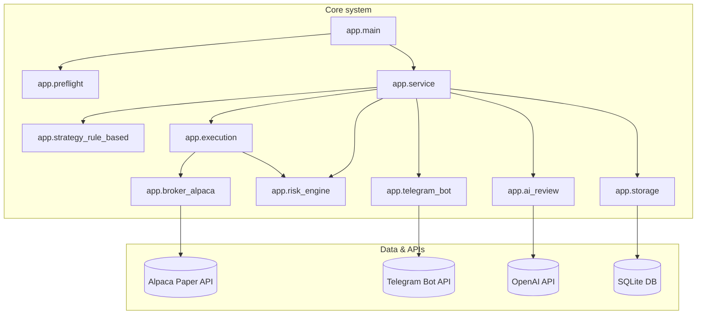
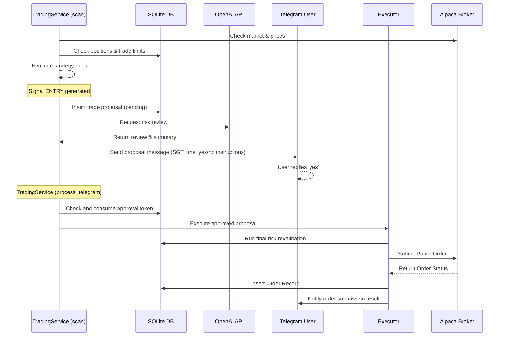
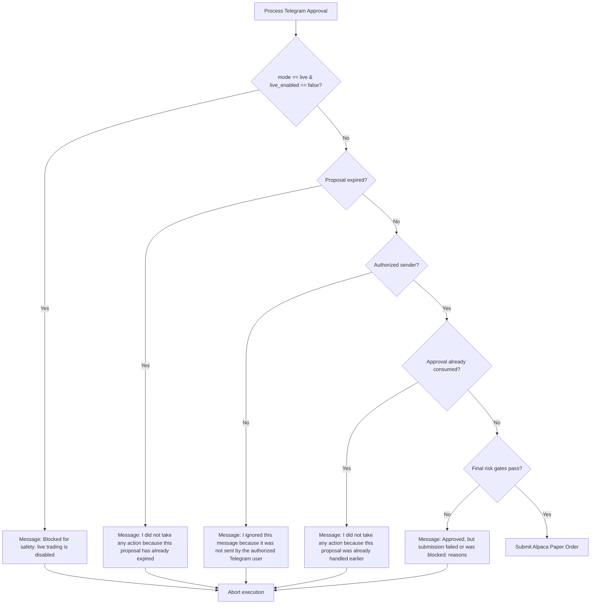

# TradingAgent SYSTEM OVERVIEW

> [!IMPORTANT]
> **Update Rule:** This file must be updated whenever code, scripts, configs, safety gates, approval flow, broker behavior, reporting, scheduling, or tests change.

### Developer Change Checklist

Before committing changes, ask:
- [ ] Did any script change?
- [ ] Did any config change?
- [ ] Did any Telegram message change?
- [ ] Did any approval behavior change?
- [ ] Did any broker behavior change?
- [ ] Did any risk limit change?
- [ ] Did any database table change?
- [ ] Did any Excel sheet change?
- [ ] Did any test expectation change?
- [ ] Did launchd status change?
- [ ] Did live trading gates change?
- If yes, update this document.

---

## 1. Project Purpose
TradingAgent is a supervised, user-gated paper trading assistant that scans a watchlist of symbols, evaluates technical rules, generates trade proposals, conducts AI-assisted risk and caution reviews, and requests user approval via Telegram. It is capable of executing approved paper trades through the Alpaca Paper Trading API but cannot place orders autonomously.
- The bot can scan and propose but **cannot execute any trades without manual Telegram approval** from the authorized user.
- The AI layer is strictly read-only and **cannot execute orders** or access credentials.
- **Live trading is completely disabled** at the config, database, and broker API levels.

## 2. Current Safety Status
The system is strictly configured for **Paper Trading Only** (`mode: paper`, `live_enabled: false`).
- All live trading functions are hard-blocked by code-level permission checks.
- A local **Kill Switch** mechanism allows immediate pause of all scanner evaluations and execution flows.
- Every order execution requires a double-validation step (first when proposed, and a final revalidation immediately before execution).

## 3. High-Level Architecture
The project follows a modular design with clear separation between:
1. **Inputs/Data**: Market data from Alpaca, system status (power, internet), user directives from Telegram.
2. **Analysis/AI**: Rule-based technical strategy indicators and OpenAI `gpt-5.4-mini` summary and caution evaluations.
3. **Safety/Control**: Local database records, `RiskEngine` limits, and manual Telegram approval gating.
4. **Execution**: The `AlpacaBroker` interface submitting orders exclusively to Alpaca paper endpoints.
5. **Output**: SQLite audit trails, local logs, and automated Excel reporting.

## 4. Folder Structure
- `app/`: Source code of the core logic.
- `config/`: Configurations, strategies, and risk limit files.
- `data/`: Databases, exports (Excel), backups, and cache.
- `docs/`: System documentation.
- `launchd/`: Templates for future OS-level scheduling.
- `logs/`: Runtime logs, audit events, and error logs.
- `scripts/`: Operational scripts and manual test runners.
- `tests/`: Project unit and integration tests.

## 5. Main Config Files
- [config.yaml](../config/config.yaml): Sets the bot's modes, watchlist, intervals, and AI model parameters.
- [risk_limits.yaml](../config/risk_limits.yaml): Sets paper and live boundaries (max notional, open positions, daily trades, and global safety toggles).
- [strategies.yaml](../config/strategies.yaml): Strategy thresholds (maximum volatility, drawdown stop).

## 6. Main App Modules
- [main.py](../app/main.py): Entry point executing single bounded cycles.
- [service.py](../app/service.py): Runs the cycle flow (polled Telegram parser -> strategy scanner -> proposal -> AI review).
- [approval_parser.py](../app/approval_parser.py): Parses Telegram approvals and rejections (supports prefix matching, side, and symbol disambiguation).
- [risk_engine.py](../app/risk_engine.py): Multi-layer safety gate validating system health and trade size limits.
- [broker_alpaca.py](../app/broker_alpaca.py): Integrates the Alpaca API and blocks live endpoint submissions.
- [execution.py](../app/execution.py): Handler final revalidation and broker submission.
- [storage.py](../app/storage.py): Manages database transactions, initialization, and approvals usage.
- [telegram_bot.py](../app/telegram_bot.py): Wrapper around the Telegram Bot API.
- [utils.py](../app/utils.py): Utility tools including timezone conversion to SGT and message templates.

## 7. Scripts and What They Do
The `scripts/` directory contains operational shell and Python scripts used for testing and execution:
- `setup_venv.sh`: Installs Python virtual environment, updates pip, and installs requirements. **[Safe/Read-only]**
- `run_once.sh`: Runs a single bounded scan and polling cycle. **[Execution-capable]**
- `export_excel.sh`: Generates the openpyxl summary report workbook. **[Safe/Read-only]**
- `test_openai_summary.sh`: Manually tests the OpenAI connection and summary generation. **[Safe/Read-only]**
- `test_alpaca_paper_connection.sh`: Verifies read-only connectivity and prints Alpaca account metrics. **[Safe/Read-only]**
- `test_fake_paper_proposal.sh`: Creates a fake pending proposal for symbol `TEST` to verify the Telegram parser. **[Proposal-only]**
- `test_paper_order_proposal.sh`: Generates a real-symbol `SPY` or `QQQ` paper proposal. **[Proposal-only]**
- `test_paper_sell_proposal.sh`: (Future) Will generate a real-symbol paper exit proposal. **[Proposal-only]**
- `store_secret_keychain.sh`: Stores API keys securely in the macOS Keychain. **[Safe/Read-only]**
- `install_launchd.sh`: Installs the launchd plist file for recurring automation. **[Scheduling-related]**
- `uninstall_launchd.sh`: Uninstalls the launchd plist file. **[Scheduling-related]**
- `rotate_logs.sh`: Truncates and backs up application logs. **[Safe/Read-only]**
- `backup_db.sh`: Creates a copy of the SQLite database file. **[Safe/Read-only]**
- `start_agent.sh` / `stop_agent.sh`: Utility scripts to load or unload the scheduled jobs. **[Scheduling-related]**
- `telegram_get_updates.py`: Small Python utility to print raw Telegram JSON updates. **[Safe/Read-only]**
- `telegram_test.py`: Simple verification script to send a basic Telegram message. **[Safe/Read-only]**

## 8. Telegram Approval Flow
Every trade proposal is written to SQLite with `status='pending'` and messaged to the authorized user via Telegram.
1. The user replies `yes` or `no` (and optionally includes symbol/ID if multiple are pending).
2. The bot parses the response, matches the candidate proposal (supporting prefix ID matching like `yes 5e165d49`), and processes approval or rejection.
3. If approved, the approval token is consumed (marked in DB to prevent duplicate double-spending) and final revalidation is executed.

## 9. Alpaca Paper Broker Flow
The broker is initialized in paper mode using keys fetched securely from the macOS Keychain.
- Submit order methods are guarded against `mode != 'paper'` unless live is explicitly enabled and confirmed.
- Supports market and limit order types, and fractional share order sizes.

## 10. OpenAI / AI Review Flow
The strategy generates trades, which are reviewed by OpenAI `gpt-5.4-mini`.
- The AI layer evaluates risk and returns caution parameters.
- The AI has **no access to broker APIs or execution tools**; it is solely an analysis layer.

## 11. Risk Engine and Safety Gates
- **Hardware/Env Gates**: Blocks trading if AC power is disconnected, internet is down, or database/broker is unreachable.
- **Position Gates**: Enforces `max_open_positions` (default 1) and `max_trades_per_day` (default 1).
- **Drawdown Gates**: Stops trading if daily/weekly loss limits are breached.
- **Expiry Gates**: Blocks execution if the proposal has expired.

## 12. Database / SQLite Tables
Stored at `data/trading_agent.db`. The schema contains the following tables:
- `runs`: History of cycles run with configuration mode.
- `preflight_checks`: Preflight health validation results.
- `market_snapshots`: Saved price snapshots from the broker.
- `indicators`: Intermediate indicator calculations.
- `signals`: Raw indicators signals generated by strategy (`ENTRY` or `EXIT`).
- `ml_predictions`: Predictive model evaluations.
- `risk_checks`: Logs of safety checks passed or failed.
- `ai_reviews`: Summaries and caution assessments from OpenAI.
- `trade_proposals`: Pending, approved, rejected, or expired proposals.
- `approvals`: Consumer records of Telegram replies (uniquely constraints prevent double-approvals).
- `orders`: Records of submitted broker orders.
- `fills`: Historical fill data from broker executions.
- `positions`: Tracked positions from the broker.
- `cash_snapshots`: Cash balance audits.
- `cashout_reviews`: Suggestions history.
- `cashout_suggestions`: Generated suggestions.
- `errors`: Logged runtime errors.
- `audit_events`: System audit log.
- `strategy_versions`: Tracked rules-based and ML versions.
- `model_versions`: ML metadata records.
- `config_snapshots`: Redacted config maps.
- `daily_summaries`: Daily equity audits.

## 13. Excel Reporting Flow
Excel exports are compiled by `app/reports.py` and exported to `data/exports/`. The sheets map to the database as follows:
- **Summary Dashboard**: Derived from database records (calculated metrics).
- **Daily PnL**: Directly database-backed (`daily_summaries`).
- **Trades**: Directly database-backed (`orders`).
- **Orders**: Directly database-backed (`orders`).
- **Fills**: Directly database-backed (`fills`).
- **Positions**: Directly database-backed (`positions`).
- **Signals**: Directly database-backed (`signals`).
- **Risk Checks**: Directly database-backed (`risk_checks`).
- **AI Reviews**: Directly database-backed (`ai_reviews`).
- **Approvals**: Directly database-backed (`approvals`).
- **Cash Management**: Directly database-backed (`cashout_suggestions`).
- **ML Shadow Metrics**: Directly database-backed (`model_versions`). Currently empty/placeholder as ML is shadow-only.
- **Errors**: Directly database-backed (`errors`).
- **Audit Events**: Directly database-backed (`audit_events`).
- **Config Snapshot**: Directly database-backed (`config_snapshots`).

## 14. Testing Strategy
- Unit and integration tests protect all core components (risk limits, config settings, parser gates, double-spend blocking, and credentials leakage).
- Verified via `pytest`.

## 15. Launchd / Scheduling Status
**Currently not installed/loaded.** The agent must be run manually or triggered for single cycles.

## 16. Live Trading Gates
Live trading is disabled. If a live proposal is attempted, it is caught and blocked by the safety gate:
`Blocked for safety: live trading is disabled.`

## 17. Current Known State
> [!WARNING]
> **Stale-State Warning:** This section reflects the last verified manual checkpoint. It must be updated after every paper execution, sell/exit test, launchd setup, risk limit change, or live-trading gate change.

- **Checkpoint Date**: June 18, 2026
- **Mode**: paper
- **Live Enabled**: false
- **Default AI Model**: `gpt-5.4-mini`
- **Active Position**: 1 position in `SPY` (qty: `0.001325081` shares)
- **Active Orders**: 0
- **Daily Trade Count**: 1

## 18. Recent Milestones Completed
- **Initial safe scaffold**: Basic project setup and configuration framework.
- **Telegram setup**: Bot token stored, chat IDs verified, and approval testing implemented.
- **OpenAI setup**: API credentials stored in Keychain and model configuration parsed.
- **Default model changed to `gpt-5.4-mini`**: Updated configs and code modules to default to the mini reasoning model.
- **Alpaca Paper connectivity checks**: Confirmed paper broker credentials and fetched read-only balance.
- **Single dry-run verification**: Executed dry cycle with SPY and QQQ generating HOLD signals.
- **Fake paper proposal approval/rejection test**: Verified rejection gates and parsed responses using a mock `TEST` proposal.
- **Controlled Alpaca Paper BUY execution test**: Successfully approved and executed a $1 paper order for `SPY`.
- **Telegram polling offset bug fix**: Resolved unacknowledged updates by updating the Telegram offset parameter in `service.py`.
- **Telegram message cleanup and system overview creation**: Overhauled bot wording, implemented Singapore Time formatting, and built the system overview document.

## 19. How to Update This Document
Whenever you edit code structure, config parameters, database tables, or broker/safety logic:
1. Update the description in the relevant section.
2. Log the change in the **Change Log** at the bottom.
3. Verify this overview document exists and has all 23 key sections by running `.venv/bin/pytest`.

---

## 20. Mermaid Diagram of System Connections

## 21. Mermaid Flowchart of Trade Proposal → Approval → Execution

## 22. Mermaid Flowchart of Safety Blocks

## 23. Change Log
- **2026-06-18**: Initial system overview created documenting safety gates, flows, milestone completions, and Mermaid diagrams.
- **2026-06-18**: Tightened system overview document by converting local links to relative markdown paths, expanding database schema/reporting details, and clarifying supervised operation constraints.
