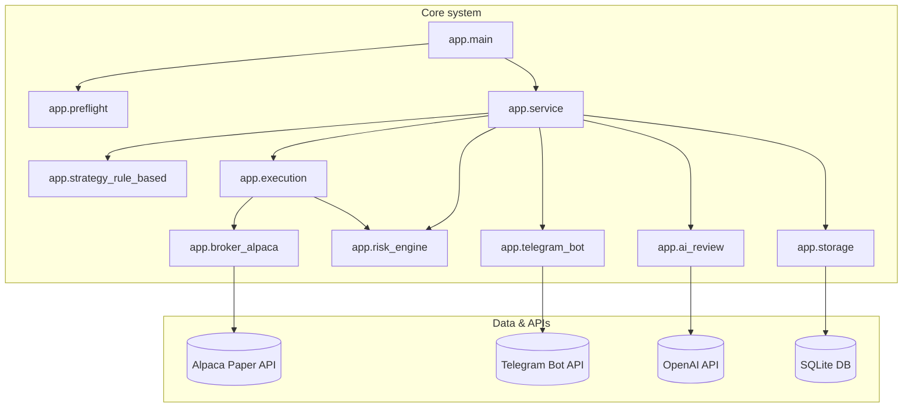
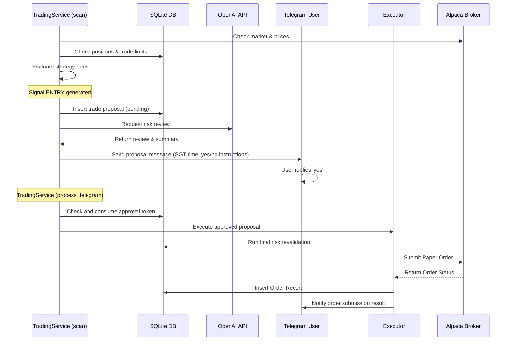
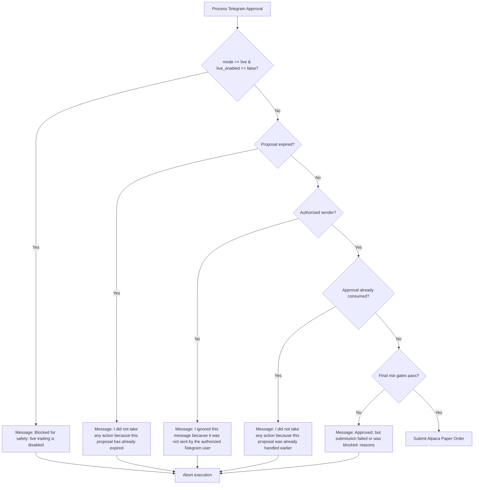

# TradingAgent SYSTEM OVERVIEW

> [!IMPORTANT]
> **Update Rule:** This file must be updated whenever code, scripts, configs, safety gates, approval flow, broker behavior, reporting, scheduling, or tests change.

### Developer Change Checklist

Before committing changes, ask:
- [ ] Did any script change?
- [ ] Did any config change?
- [ ] Did any Telegram message change?
- [ ] Did any approval behavior change?
- [ ] Did any broker behavior change?
- [ ] Did any risk limit change?
- [ ] Did any database table change?
- [ ] Did any Excel sheet change?
- [ ] Did any test expectation change?
- [ ] Did launchd status change?
- [ ] Did live trading gates change?
- If yes, update this document.

---

## 1. Project Purpose
TradingAgent is a supervised, user-gated paper trading assistant that scans a watchlist of symbols, evaluates technical rules, generates trade proposals, conducts AI-assisted risk and caution reviews, and requests user approval via Telegram. It is capable of executing approved paper trades through the Alpaca Paper Trading API but cannot place orders autonomously.
- The bot can scan and propose but **cannot execute any trades without manual Telegram approval** from the authorized user.
- The AI layer is strictly read-only and **cannot execute orders** or access credentials.
- **Live trading is completely disabled** at the config, database, and broker API levels.

## 2. Current Safety Status
The system is strictly configured for **Paper Trading Only** (`mode: paper`, `live_enabled: false`).
- Live trading is disabled by current configuration (`mode: paper`, `live_enabled: false`, `explicit_live_confirmation: false`) and rejected by a non-configurable capability gate in this build.
- The current build now also has non-configurable code capability gates: live trading and auto-execution are both unsupported even if YAML is changed.
- A local **Kill Switch** mechanism allows immediate pause of all scanner evaluations and execution flows.
- Every order execution requires manual Telegram approval plus a double-validation step. Final validation refreshes broker/account loss and margin state, internet, Telegram, broker, database, power, and market state; unknown values block execution.

## 3. High-Level Architecture
The project follows a modular design with clear separation between:
1. **Inputs/Data**: Market data from Alpaca, system status (power, internet), user directives from Telegram.
2. **Analysis/AI**: Rule-based technical strategy indicators and OpenAI `gpt-5.4-mini` summary and caution evaluations.
3. **Safety/Control**: Local database records, `RiskEngine` limits, and manual Telegram approval gating.
4. **Execution**: The `AlpacaBroker` interface submitting orders exclusively to Alpaca paper endpoints.
5. **Output**: SQLite audit trails, local logs, and automated Excel reporting.

## 4. Folder Structure
- `app/`: Source code of the core logic.
- `config/`: Configurations, strategies, and risk limit files.
- `data/`: Databases, exports (Excel), backups, and cache.
- `docs/`: System documentation.
- `launchd/`: Source template for the currently installed 10-minute LaunchAgent.
- `logs/`: Runtime logs, audit events, and error logs.
- `scripts/`: Operational scripts and manual test runners.
- `tests/`: Project unit and integration tests.

## 5. Main Config Files
- [config.yaml](../config/config.yaml): Sets the bot's modes, watchlist, intervals, and AI model parameters.
- [risk_limits.yaml](../config/risk_limits.yaml): Sets paper and live boundaries (max notional, open positions, daily trades, and global safety toggles).
- [strategies.yaml](../config/strategies.yaml): Strategy thresholds (maximum volatility, drawdown stop).

## 6. Main App Modules
- [main.py](../app/main.py): Entry point executing single bounded cycles.
- [service.py](../app/service.py): Runs the cycle flow (polled Telegram parser -> strategy scanner -> proposal -> AI review).
- [approval_parser.py](../app/approval_parser.py): Parses Telegram approvals and rejections (supports prefix matching, side, and symbol disambiguation).
- [risk_engine.py](../app/risk_engine.py): Multi-layer safety gate validating system health and trade size limits.
- [broker_alpaca.py](../app/broker_alpaca.py): Integrates Alpaca Paper, exposes read-only clock/loss/order lookup methods, and rejects all live clients in this build.
- [execution.py](../app/execution.py): Handler final revalidation and broker submission.
- [reconciliation.py](../app/reconciliation.py): Read-only broker reconciliation that updates local order/fill/account/position records without submitting or retrying orders.
- [capabilities.py](../app/capabilities.py): Non-configurable hard gates keeping live trading and auto-execution unsupported.
- [run_lock.py](../app/run_lock.py): Inspects PID/timestamp lock metadata and identifies only safely recoverable stale locks.
- [storage.py](../app/storage.py): Manages database transactions, initialization, and approvals usage.
- [telegram_bot.py](../app/telegram_bot.py): Wrapper around the Telegram Bot API.
- [utils.py](../app/utils.py): Utility tools including timezone conversion to SGT and message templates.

## 7. Scripts and What They Do
The `scripts/` directory contains operational shell and Python scripts used for testing and execution:
- `setup_venv.sh`: Creates/updates the Python virtual environment and installs requirements. **[Local-state modifying]**
- `run_once.sh`: Runs a single bounded scan and polling cycle. **[Execution-capable]**
- `export_excel.sh`: Generates the openpyxl summary report workbook. **[Safe/Read-only]**
- `test_openai_summary.sh`: Manually tests the OpenAI connection and summary generation. **[Safe/Read-only]**
- `test_alpaca_paper_connection.sh`: Verifies read-only connectivity and prints Alpaca account metrics. **[Safe/Read-only]**
- `test_fake_paper_proposal.sh`: Creates a fake pending proposal for symbol `TEST` to verify the Telegram parser. **[Proposal-only]**
- `test_paper_order_proposal.sh`: Generates a real-symbol `SPY` or `QQQ` paper proposal. **[Proposal-only]**
- `test_paper_sell_proposal.sh`: Generates a real-symbol `SPY` paper exit proposal. **[Proposal-only]**
- `safe_commit_push.sh`: Helper to run pytest, perform a limited staged-file secret scan, verify doc presence, then commit and push. **[Git-state modifying]**
- `store_secret_keychain.sh`: Stores API keys securely in the macOS Keychain. **[Safe/Read-only]**
- `install_launchd.sh`: Installs the launchd plist file for recurring automation. **[Scheduling-related]**
- `uninstall_launchd.sh`: Uninstalls the launchd plist file. **[Scheduling-related]**
- `rotate_logs.sh`: Deletes/archives logs according to retention rules. **[Local-state modifying]**
- `backup_db.sh`: Creates and retains local SQLite/archive copies. **[Local-state modifying]**
- `start_agent.sh` / `stop_agent.sh`: Utility scripts to load or unload the scheduled jobs. **[Scheduling-related]**
- `telegram_get_updates.py`: Small Python utility to print raw Telegram JSON updates. **[Safe/Read-only]**
- `telegram_test.py`: Simple verification script to send a basic Telegram message. **[Safe/Read-only]**

## 8. Telegram Approval Flow
Every trade proposal is written to SQLite with `status='pending'` and messaged to the authorized user via Telegram.
1. The user replies `yes` or `no` (and optionally includes symbol/ID if multiple are pending).
2. The bot parses the response, matches the candidate proposal (supporting prefix ID matching like `yes 5e165d49`), and processes approval or rejection.
3. If approved, the approval token is consumed (marked in DB to prevent duplicate double-spending) and final revalidation is executed.

## 9. Alpaca Paper Broker Flow
The broker is initialized in paper mode using keys fetched securely from the macOS Keychain.
- Submit order methods are guarded against `mode != 'paper'` unless live is explicitly enabled and confirmed.
- Supports market and limit order types, and fractional share order sizes.

## 10. OpenAI / AI Review Flow
The strategy generates trades, which are reviewed by OpenAI `gpt-5.4-mini` (or the configured reasoning model).
- **No Authority**: The AI review layer has **no access to broker APIs or execution tools**; it is strictly an analysis layer and cannot place or execute orders.
- **Rule-Based Precedence**: GPT cannot create or override the rule-based trade decision score from scratch, and it cannot override risk engine gates or bypass Telegram user approvals.
- **Structured Fields**: When called, the AI review returns structured fields:
  - `gpt_confidence`: High / Medium / Low
  - `gpt_caution`: Low / Medium / High
  - `main_risk`: A short warning sentence
  - `supports_system_score`: yes/no
  - `reason`: Explanation of the critique
- **Throttled State**: If GPT is not called (due to scoring thresholds or daily call throttle limits), the Telegram proposal displays: `GPT review: Not called because score/signal did not meet review threshold.`

## 11. Risk Engine and Safety Gates
- **Scoring Systems**:
  - **Asset Selection Score** (0–100): Ranks approved watchlist symbols compared with observation universe symbols based on liquidity, trend, volatility, and data quality. It is used for prioritization and does not trigger orders by itself.
  - **Trade Decision Score** (0–100): Deterministic score measuring setup strength. Derived from the following 100-point weighting:
    - Strategy signal strength: 25
    - Asset selection/rank: 15
    - Recent 10-minute movement: 10
    - Session trend: 10
    - Volatility sanity: 15 (graded across volatility regimes)
    - Risk safety: 15
    - Data quality/freshness: 10
  - **Confidence Labels**:
    - 90–100: "Very strong paper setup" (System confidence: "Very strong")
    - 80–89: "Strong paper setup" (System confidence: "Strong")
    - 65–79: "Moderate paper setup" (System confidence: "Moderate")
    - 50–64: "Weak setup, watch only" (System confidence: "Weak")
    - Below 50: "No action suggested" (System confidence: "No action suggested")
- **Volatility Regimes & Limits**:
  - ENTRY requires annualized realized volatility <= 45% (removing the previous conservative 5% binary hard veto).
  - Volatility sanity component (max 15 points) is graded across 5 regimes:
    - **0%–8%**: Too quiet; eligible for entry but receives a weak score (8/15)
    - **8%–25%**: Normal ETF volatility regime; receives full score (15/15)
    - **25%–35%**: Elevated volatility; receives reduced score (10/15), and paper notional size is automatically reduced by 50% for caution
    - **35%–45%**: High volatility; receives watch-only score (5/15) and blocks new entries (watch-only)
    - **Above 45% or missing/invalid**: Extreme volatility/missing data; receives 0/15 points and hard blocks new entries
  - Position-reducing exits and risk controls are exempt from volatility restrictions.
- **State-Based Proposal Deduplication**:
  - To prevent alert spam, new proposals are blocked if an active pending proposal for the same symbol + side exists, or if a similar proposal was generated within the last 60 minutes.
  - The 60-minute cooldown is bypassed only if:
    - It is a position-reducing exit (and a real position exists), or
    - The Trade Decision Score improves by $\ge 10$ points compared to the last proposal.
  - Deduplication actions are tracked in the database and audit events, and do not bypass approvals.
- **Dynamic Expiry Rules**:
  - Expiry durations are calculated dynamically per cycle (never below 5 minutes, never above 20 minutes).
  - Base values: Normal buy/sell is 15 minutes, exits/sells are 10 minutes. High volatility limits base to 5 minutes, and low volatility extends base to 20 minutes.
  - Modifiers: Weak setups subtract 2 minutes, very strong setups add 2 minutes. Stale price data subtracts 3 minutes.
  - Close proximity: If market close is near, the duration is truncated to close time (min 5).
  - Expiry notifications: If no yes/no reply is received before SGT expiry time, the proposal is marked as expired, a single natural language Telegram expiry notification is sent, and any execution attempt is blocked. Approved/rejected proposals do not send expiry notifications.
- **Hardware/Env Gates**: Blocks trading if AC power is disconnected, internet is down, or database/broker is unreachable.
- **Position Gates**: Enforces `max_open_positions` (default 1) and `max_trades_per_day` (default 1).
- **Drawdown Gates**: Stops trading if daily/weekly loss limits are breached.
- **Expiry Gates**: Blocks execution if the proposal has expired.
- **Live Trading & Auto-Execution**: Both are unsupported by code-level capability constants as well as disabled in configuration. YAML and Telegram cannot enable them. Normal operation requires Telegram approval and no reply means no order.
- **Authoritative Final Context**: Daily/weekly losses come from Alpaca account/portfolio history, margin use comes from current account values, and broker/internet/Telegram/database health is checked rather than assumed. Missing loss or margin state blocks risk approval.

## 12. Database / SQLite Tables
Stored at `data/trading_agent.db`. The schema contains the following tables:
- `runs`: History of cycles run with configuration mode.
- `preflight_checks`: Preflight health validation results.
- `market_snapshots`: Saved price snapshots from the broker.
- `indicators`: Intermediate indicator calculations.
- `signals`: Raw indicators signals generated by strategy (`ENTRY` or `EXIT`).
- `ml_predictions`: Predictive model evaluations.
- `risk_checks`: Logs of safety checks passed or failed.
- `ai_reviews`: Summaries and caution assessments from OpenAI.
- `trade_proposals`: Pending, approved, rejected, or expired proposals.
- `approvals`: Consumer records of Telegram replies (uniquely constraints prevent double-approvals).
- `orders`: Records of submitted broker orders.
- `fills`: Historical fill data from broker executions.
- `positions`: Tracked positions from the broker.
- `cash_snapshots`: Cash balance audits.
- `cashout_reviews`: Suggestions history.
- `cashout_suggestions`: Generated suggestions.
- `errors`: Logged runtime errors.
- `audit_events`: System audit log.
- `strategy_versions`: Tracked rules-based and ML versions.
- `model_versions`: ML metadata records.
- `config_snapshots`: Redacted config maps.
- `daily_summaries`: Daily equity audits.
- `market_memory`: Logs of scheduled observation telemetry (currently a 10-minute target interval), indicators, and recommendation scores.
- `telegram_digests`: History of 30-minute Telegram informational digests.

## 13. Excel Reporting Flow
Excel exports are compiled by `app/reports.py` and exported to `data/exports/`. The sheets map to the database as follows:
- Telegram raw text and sender IDs are redacted by default. JSON payloads are recursively redacted and scanned for supported secret-value patterns before cells are written.
- **Summary Dashboard**: Derived from database records (calculated metrics).
- **Daily PnL**: Directly database-backed (`daily_summaries`).
- **Trades**: Directly database-backed (`orders`).
- **Orders**: Directly database-backed (`orders`).
- **Fills**: Directly database-backed (`fills`).
- **Positions**: Directly database-backed (`positions`).
- **Signals**: Directly database-backed (`signals`).
- **Risk Checks**: Directly database-backed (`risk_checks`).
- **AI Reviews**: Directly database-backed (`ai_reviews`).
- **Approvals**: Directly database-backed (`approvals`).
- **Cash Management**: Directly database-backed (`cashout_suggestions`).
- **ML Shadow Metrics**: Directly database-backed (`model_versions`). Currently empty/placeholder as ML is shadow-only.
- **Errors**: Directly database-backed (`errors`).
- **Audit Events**: Directly database-backed (`audit_events`).
- **Config Snapshot**: Directly database-backed (`config_snapshots`).
- **Market Memory**: Telemetry comparison logs (`market_memory`).

## 14. Testing Strategy
- Unit and integration tests protect all core components (risk limits, config settings, parser gates, double-spend blocking, and credentials leakage).
- Verified via `pytest`.

## 15. Launchd / Scheduling Status
**Installed and loaded.**
- **Label**: `com.elijah.tradingagent`
- **Schedule**: Every 10 minutes (`StartInterval`: 600 seconds)
- **Command Run**: `/Users/elijahang/Projects/TradingAgent/scripts/run_once.sh`
- **Working Directory**: `/Users/elijahang/Projects/TradingAgent`
- **Stdout Log**: `logs/runtime/launchd.out`
- **Stderr Log**: `logs/errors/launchd.err`
- **How to Check Status**: Run `launchctl list | grep tradingagent`
- **How to Stop/Disable Agent**: Run `./scripts/stop_agent.sh` (or `touch config/KILL_SWITCH`)
- **How to Uninstall**: Run `./scripts/uninstall_launchd.sh`
- **How to Run Manually**: Run `./scripts/run_once.sh`
- **Behavior**: Scheduled runs are observation and scoring-first. GPT and Telegram calls are throttled and not triggered every 10 minutes by default. A Telegram approval response is strictly required before order execution, and live trading remains disabled.
- **Reconciliation**: Each passing cycle reads existing Alpaca order/account/position state and reconciles SQLite before scanning. Reconciliation has no submission or retry operation.
- **Lock Recovery**: `run_once.sh` records PID and epoch time. Active/recent locks are preserved; only a dead owner older than the grace period is atomically recovered and audited.
- **macOS Sandbox Note**: The project has been relocated to `/Users/elijahang/Projects/TradingAgent` to completely bypass the macOS TCC/Sandbox restrictions on `~/Desktop`, ensuring launchd runs execute successfully without requiring system-wide Full Disk Access configurations.

## 16. Live Trading Gates
Live trading is disabled. If a live proposal is attempted, it is caught and blocked by the safety gate:
`Blocked for safety: live trading is disabled.`

## 17. Current Known State
> [!WARNING]
> **Stale-State Warning:** This section reflects the last verified manual checkpoint. It must be updated after every paper execution, sell/exit test, launchd setup, risk limit change, or live-trading gate change.

- **Checkpoint Date**: June 22, 2026
- **Mode**: paper
- **Live Enabled**: false
- **Default AI Model**: `gpt-5.4-mini`
- **Active Position**: 0 positions (the SPY position has been closed)
- **Active Orders**: 0
- **Daily Trade Count**: 0 local order rows for June 22; Alpaca reports two older filled paper orders

## 18. Recent Milestones Completed
- **Initial safe scaffold**: Basic project setup and configuration framework.
- **Telegram setup**: Bot token stored, chat IDs verified, and approval testing implemented.
- **OpenAI setup**: API credentials stored in Keychain and model configuration parsed.
- **Default model changed to `gpt-5.4-mini`**: Updated configs and code modules to default to the mini reasoning model.
- **Alpaca Paper connectivity checks**: Confirmed paper broker credentials and fetched read-only balance.
- **Single dry-run verification**: Executed dry cycle with SPY and QQQ generating HOLD signals.
- **Fake paper proposal approval/rejection test**: Verified rejection gates and parsed responses using a mock `TEST` proposal.
- **Controlled Alpaca Paper BUY execution test**: Successfully approved and executed a $1 paper order for `SPY`.
- **Telegram message cleanup and system overview creation**: Overhauled bot wording, implemented Singapore Time formatting, and built the system overview document.
- **Controlled Alpaca Paper SELL execution test**: Successfully approved and executed a paper sell order to close the SPY position.
- **GitHub remote integration & scheduled scoring**: Configured the remote repository, added a limited staged-file secret-scan helper, and designed lightweight 10-minute observation telemetry.

## 19. How to Update This Document
Whenever you edit code structure, config parameters, database tables, or broker/safety logic:
1. Update the description in the relevant section.
2. Log the change in the **Change Log** at the bottom.
3. Verify this overview document exists and has all 23 key sections by running `.venv/bin/pytest`.

---

## 20. Mermaid Diagram of System Connections

## 21. Mermaid Flowchart of Trade Proposal → Approval → Execution

## 22. Mermaid Flowchart of Safety Blocks

## 24. Power-Management Plan
To support the bot's current 10-minute schedule during trading hours:
1. **Mac State**: The Mac must remain awake during the trading window when plugged into AC power. Display sleep and screen saver are allowed, but full system sleep must be avoided.
2. **Safest Option (caffeinate)**: The safest and most robust option is using the built-in macOS CLI tool `caffeinate`. The user can run:
   `caffeinate -dim -t 23400 &`
   to prevent idle/system sleep for 6.5 hours (the US market session duration) without permanently changing system-level settings.
3. **Alternative (pmset)**: Alternatively, the system energy preferences can be configured via:
   `sudo pmset -c sleep 0` (only when plugged into AC power).
4. **Preflight Gates**:
   - If AC power is disconnected, the preflight checks fail, and the execution is aborted cleanly.
   - If internet connectivity is lost, the internet preflight check fails, and execution aborts.
5. **Missed Intervals**:
   - launchd `StartInterval` triggers does not replay missed runs in a burst after waking up. It will only run the next scheduled cycle.
   - The run lock `logs/runtime/agent.lockdir` ensures overlapping runs never occur.

## 26. Market Coverage & Data Provider Policy
- **US Equities/ETFs**: The system uses **Alpaca** as the broker and data source. Alpaca is configured for US-listed symbols only and is limited to Paper trading mode.
- **Market Hours & Holidays**:
  - The system queries the broker's real-time clock API to check if the market is open.
  - On weekends and US market holidays (such as Juneteenth, Independence Day, Thanksgiving, Christmas, etc.), the broker reports the market is closed, causing the preflight `market_open` gate to fail.
  - When the preflight gate fails, the execution cycle aborts cleanly and logs the run status as `blocked` with detail `market_open`.
  - No database proposals are generated, no GPT calls are made, no Telegram messages are sent, and no orders can be executed during market closed hours or holidays.
- **Singapore (SGX) & Hong Kong (HKEX)**:
  - SGX and HKEX observation profiles (e.g., `sgx_observation`, `hkex_observation`) are strictly placeholders/disabled.
  - Integration with SGX or HKEX requires a separate, dedicated market data provider or broker API to be explicitly configured.
  - Alpaca **cannot** be assigned as a data provider or broker for SGX or HKEX, and any configuration trying to do so is blocked.
  - If a profile is active but has no data provider or broker (e.g., `broker: none` or missing), the system logs a `data_source_missing` warning and skips scanning for safety.
  - Daytime market observation for SGX/HKEX is a future extension to be developed once a proper data provider has been selected and configured.
- **Anti-Hallucination Guardrails**:
  - The system **never** creates fake SGX/HKEX market data, does not scrape random web pages, and does not add uncontrolled news/data scraping.
  - The system must not hallucinate, mock, or infer live market data. If real, structured data is not available from an approved API, the symbol/profile is skipped.
  - Profiles for SGX/HKEX are configured as `observation_only` or `disabled` with `execution_enabled: false` and `proposals_enabled: false` to ensure no proposals are created or executed.

## 27. Telegram Market Digest
- **Purpose**: Sends a 30-minute informational digest to the user during active US regular trading hours (9:30 PM to 4:00 AM SGT, or based on the broker's clock is_open API) summarizing recent telemetry.
- **Informational Only**: Unlike trade proposal messages, the digest is strictly informational. It does not ask for user approval, does not create trade proposals in the database, and does not place or execute broker orders.
- **Wording & Formatting**: Displays market open status, a SGT local time window, top watched symbols (capped at 6), weakest symbol, action counters (proposals, orders, GPT calls, and expirations over the last 30 minutes), and a plain English summary concluding with "No action needed."
- **Throttling Constraints**: Computes data from the last 30 minutes, requiring a minimum of 2 successful cycles logged in `market_memory`. It checks `telegram_digests` history to ensure it is sent at most once per 30 minutes.
- **GPT Usage**: GPT is not used for digests by default (`telegram_digest_use_gpt: false`). It relies entirely on rules-based, logged sqlite data to construct summaries.

## 25. Change Log
- **2026-06-18**: Initial system overview created documenting safety gates, flows, milestone completions, and Mermaid diagrams.
- **2026-06-18**: Tightened system overview document by converting local links to relative markdown paths, expanding database schema/reporting details, and clarifying supervised operation constraints.
- **2026-06-19**: Executed controlled Alpaca Paper SELL exit test, updated current known position state to zero, and documented `test_paper_sell_proposal.sh` as an active script.
- **2026-06-19**: Implemented GitHub workflow remote setup, safe commit push helper, deterministic Trade Decision Score (0-100), market memory DB logging, and GPT call throttling.
- **2026-06-19**: Installed and loaded the launchd scheduled agent, later set to 10 minutes, verified preflight gates, and documented the power-management plan.
- **2026-06-22**: Upgraded Telegram proposals with rule-based and GPT confidence reviews, implemented dynamic proposal expiry times (5-20 min limits), added one-shot expiry notifications, extended SQLite market_memory columns for reporting, and added validation tests.
- **2026-06-22**: Implemented a 30-minute Telegram informational market digest feature with database logging, throttling constraints, Excel reporting, and validation tests.
- **2026-06-22**: Audited the active system and corrected stale documentation concerning scheduling, script side effects, live/auto-execution guarantees, and current paper-account state.
- **2026-06-22**: Repaired authoritative final-risk context, hard-disabled live/auto capabilities, added read-only order/fill reconciliation, safe stale-lock recovery, report/Telegram redaction, and functional near-close clock handling.
- **2026-06-23**: Implemented graded volatility regime scoring calibration, watch-only restricts, paper size adjustments, state-based proposal deduplication checks, and updated tests.
