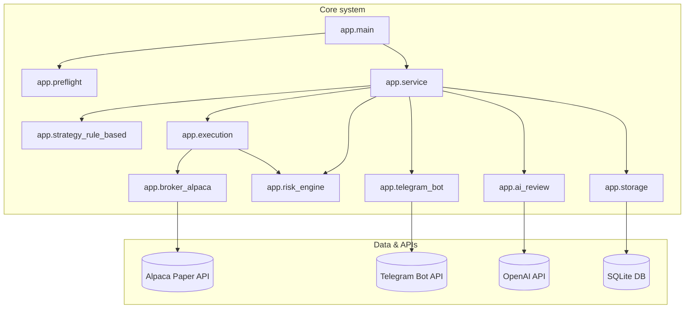
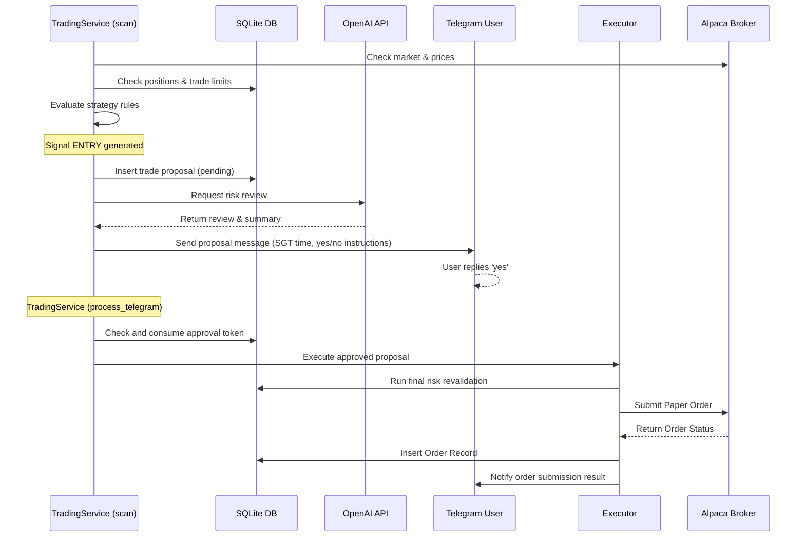
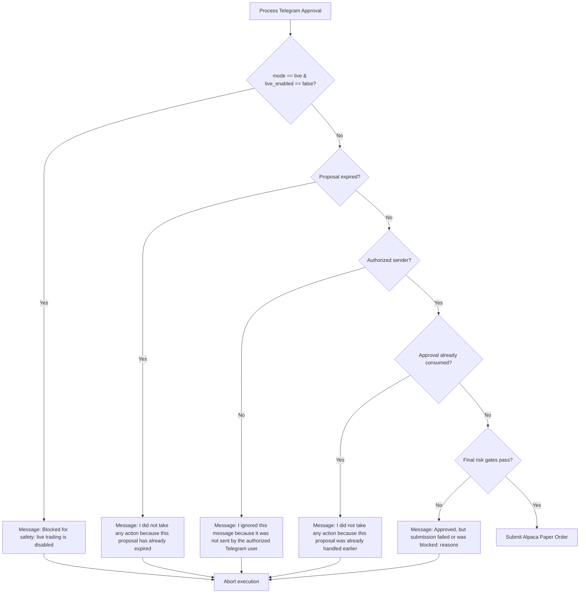

# TradingAgent SYSTEM OVERVIEW

> [!IMPORTANT]
> **Update Rule:** This file must be updated whenever code, scripts, configs, safety gates, approval flow, broker behavior, reporting, scheduling, or tests change.

### Developer Change Checklist

Before committing changes, ask:
- [ ] Did any script change?
- [ ] Did any config change?
- [ ] Did any Telegram message change?
- [ ] Did any approval behavior change?
- [ ] Did any broker behavior change?
- [ ] Did any risk limit change?
- [ ] Did any database table change?
- [ ] Did any Excel sheet change?
- [ ] Did any test expectation change?
- [ ] Did launchd status change?
- [ ] Did live trading gates change?
- If yes, update this document.

---

## 1. Project Purpose
TradingAgent is a supervised, user-gated paper trading assistant that scans a watchlist of symbols, evaluates technical rules, generates trade proposals, conducts AI-assisted risk and caution reviews, and requests user approval via Telegram. It is capable of executing approved paper trades through the Alpaca Paper Trading API but cannot place orders autonomously.
- The bot can scan and propose but **cannot execute any trades without manual Telegram approval** from the authorized user.
- The AI layer is strictly read-only and **cannot execute orders** or access credentials.
- **Live trading is completely disabled** at the config, database, and broker API levels.

## 2. Current Safety Status
The system is strictly configured for **Paper Trading Only** (`mode: paper`, `live_enabled: false`).
- Live trading is disabled by current configuration (`mode: paper`, `live_enabled: false`, `explicit_live_confirmation: false`) and rejected by a non-configurable capability gate in this build.
- The current build now also has non-configurable code capability gates: live trading and auto-execution are both unsupported even if YAML is changed.
- A local **Kill Switch** mechanism allows immediate pause of all scanner evaluations and execution flows.
- Every order execution requires manual Telegram approval plus a double-validation step. Final validation refreshes broker/account loss and margin state, internet, Telegram, broker, database, power, and market state; unknown values block execution.

## 3. High-Level Architecture
The project follows a modular design with clear separation between:
1. **Inputs/Data**: Broker market data from Alpaca for current execution workflows, EODHD-backed research data for Dynamic Universe discovery, system status (power, internet), and user directives from Telegram.
2. **Analysis/AI**: Rule-based technical strategy indicators and OpenAI `gpt-5.4-mini` summary and caution evaluations.
3. **Safety/Control**: Local database records, `RiskEngine` limits, and manual Telegram approval gating.
4. **Execution**: The `AlpacaBroker` interface submitting orders exclusively to Alpaca paper endpoints.
5. **Output**: SQLite audit trails, local logs, and automated Excel reporting.

## 4. Folder Structure
- `app/`: Source code of the core logic.
- `config/`: Configurations, strategies, and risk limit files.
- `data/`: Databases, exports (Excel), backups, and cache.
- `docs/`: System documentation.
- `launchd/`: Source template for the currently installed 10-minute LaunchAgent.
- `logs/`: Runtime logs, audit events, and error logs.
- `scripts/`: Operational scripts and manual test runners.
- `tests/`: Project unit and integration tests.

## 5. Main Config Files
- [config.yaml](../config/config.yaml): Sets the bot's modes, watchlist, intervals, and AI model parameters.
- [risk_limits.yaml](../config/risk_limits.yaml): Sets paper and live boundaries (max notional, open positions, daily trades, and global safety toggles).
- [strategies.yaml](../config/strategies.yaml): Strategy thresholds (maximum volatility, drawdown stop).

## 6. Main App Modules
- [main.py](../app/main.py): Entry point executing single bounded cycles.
- [service.py](../app/service.py): Runs the cycle flow (polled Telegram parser -> strategy scanner -> proposal -> AI review).
- [approval_parser.py](../app/approval_parser.py): Parses Telegram approvals and rejections (supports prefix matching, side, and symbol disambiguation).
- [risk_engine.py](../app/risk_engine.py): Multi-layer safety gate validating system health and trade size limits.
- [position_management.py](../app/position_management.py): Deterministic position classifier for profit-taking, profit protection, trailing stops, and healthy-pullback add candidates. It returns decisions only and does not place orders.
- [dynamic_universe.py](../app/dynamic_universe.py): Deterministic research engine that discovers, scores, promotes, demotes, and audits symbols across raw, research, observation, paper-tradable, and demoted tiers. It does not place orders or bypass proposal approval.
- [data_providers/](../app/data_providers): Research-provider abstraction and EODHD implementation. EODHD is used only for discovery/research data; Alpaca remains the paper broker/execution/reconciliation authority.
- [broker_alpaca.py](../app/broker_alpaca.py): Integrates Alpaca Paper, exposes read-only clock/loss/order lookup methods, and rejects all live clients in this build.
- [execution.py](../app/execution.py): Handler final revalidation and broker submission.
- [reconciliation.py](../app/reconciliation.py): Read-only broker reconciliation that updates local order/fill/account/position records without submitting or retrying orders.
- [capabilities.py](../app/capabilities.py): Non-configurable hard gates keeping live trading and auto-execution unsupported.
- [run_lock.py](../app/run_lock.py): Inspects PID/timestamp lock metadata and identifies only safely recoverable stale locks.
- [storage.py](../app/storage.py): Manages database transactions, initialization, and approvals usage.
- [telegram_bot.py](../app/telegram_bot.py): Wrapper around the Telegram Bot API.
- [utils.py](../app/utils.py): Utility tools including timezone conversion to SGT and message templates.

## 7. Scripts and What They Do
The `scripts/` directory contains operational shell and Python scripts used for testing and execution:
- `setup_venv.sh`: Creates/updates the Python virtual environment and installs requirements. **[Local-state modifying]**
- `run_once.sh`: Runs a single bounded scan and polling cycle. **[Execution-capable]**
- `export_excel.sh`: Generates the openpyxl summary report workbook. **[Safe/Read-only]**
- `test_openai_summary.sh`: Manually tests the OpenAI connection and summary generation. **[Safe/Read-only]**
- `test_alpaca_paper_connection.sh`: Verifies read-only connectivity and prints Alpaca account metrics. **[Safe/Read-only]**
- `test_fake_paper_proposal.sh`: Creates a fake pending proposal for symbol `TEST` to verify the Telegram parser. **[Proposal-only]**
- `test_paper_order_proposal.sh`: Generates a real-symbol `SPY` or `QQQ` paper proposal. **[Proposal-only]**
- `test_paper_sell_proposal.sh`: Generates a real-symbol `SPY` paper exit proposal. **[Proposal-only]**
- `safe_commit_push.sh`: Helper to run pytest, perform a limited staged-file secret scan, verify doc presence, then commit and push. **[Git-state modifying]**
- `store_secret_keychain.sh`: Stores API keys securely in the macOS Keychain. **[Safe/Read-only]**
- `install_launchd.sh`: Installs the launchd plist file for recurring automation. **[Scheduling-related]**
- `uninstall_launchd.sh`: Uninstalls the launchd plist file. **[Scheduling-related]**
- `rotate_logs.sh`: Deletes/archives logs according to retention rules. **[Local-state modifying]**
- `backup_db.sh`: Creates and retains local SQLite/archive copies. **[Local-state modifying]**
- `start_agent.sh` / `stop_agent.sh`: Utility scripts to load or unload the scheduled jobs. **[Scheduling-related]**
- `telegram_get_updates.py`: Small Python utility to print raw Telegram JSON updates. **[Safe/Read-only]**
- `telegram_test.py`: Simple verification script to send a basic Telegram message. **[Safe/Read-only]**

## 8. Telegram Approval Flow
Every trade proposal is written to SQLite with `status='pending'`, assigned a Telegram `message_id` once transmitted, and messaged to the authorized user.

- **Reply-To Proposal Targeting**: 
  - The system stores each proposal's `proposal_id`, `symbol`, `side/action`, `telegram_message_id`, `expires_at`, and `status`.
  - When the authorized user replies directly to a proposal message:
    - The bot reads `reply_to_message.message_id` and matches it to the stored proposal.
    - If the reply text is `yes`, it approves that specific proposal.
    - If the reply text is `no`, it rejects that specific proposal.
    - No symbol or proposal ID is required when reply-to targeting is used.

- **Plain Yes/No Ambiguity Resolution**:
  - If the user sends a plain `yes` or `no` without replying to a specific message:
    - If exactly one pending proposal exists, the system processes it.
    - If multiple pending proposals exist, the system does not guess. It replies with a clarification message:
      `I found multiple pending proposals. Please reply directly to the proposal message, or include the symbol/proposal ID, such as "yes SPY" or "no DIA".`

- **Instant Acknowledgement Messages**:
  - When the user sends a response, the bot immediately acknowledges it:
    - **Approval Received**: `✅ Received: YES for [symbol] paper [side] proposal. I will now run the final safety check. No order will be placed unless the final check passes.`
    - **Paper Order Submitted**: `✅ Paper order submitted: Buy [symbol] for $[amount]. Mode: paper only.` (or equivalent for sell).
    - **Blocked by Safety Check**: `⚠️ Approved, but no order was placed. Reason: [clear reason].`
    - **Rejection**: `❌ Received: NO for [symbol] paper [side] proposal. Proposal rejected. No order will be placed.`
    - **Expired**: `⏳ This proposal has already expired. No order was placed.`
    - **Ambiguous**: `I found multiple pending proposals. Please reply directly to the proposal message, or include the symbol/proposal ID.`

## 9. Dynamic Universe Research Engine
The Dynamic Universe Engine follows `research many -> watch some -> trade few -> measure all`.

- EODHD is the first research/discovery provider behind `app/data_providers`. API keys are read from environment/Keychain, never code.
- EODHD capability is tracked per endpoint. Plan-limited endpoints are marked and cooled down so unavailable endpoints are not called repeatedly every cycle.
- Research scoring is tailored to the current EOD+Intraday plan. Screener, EOD bars, realtime quote, and intraday bars are core inputs; most technical values are computed locally from bars. Fundamentals are non-gating, and news is an optional catalyst bonus that is neutral when unavailable or rate-limited.
- Research scoring can operate on partial provider coverage. EOD bars plus quote can produce research candidates with explicit data confidence; missing optional enrichment reduces confidence or score but does not automatically block raw-to-research promotion. Missing usable price/liquidity data still blocks promotion.
- A `research_candidate` has passed intake classification, bad-symbol exclusion, available EODHD checks, local quantitative scoring, and deterministic candidate brief generation. It means "selected for tracking and deeper explanation," not full analyst-level research completion.
- Symbol intake is separated into `alpaca_compatible_us`, `global_research_only`, and `excluded_or_low_quality` lanes. Only the Alpaca-compatible US lane can enter the paper scanner after recorded promotion evidence; global and low-quality symbols remain research/reporting-only.
- Alpaca remains broker-only for paper order submission, reconciliation, positions, fills, and the existing execution-time market truth.
- Dynamic tiers:
  - `raw_universe`: discovered symbols only, never executable.
  - `research_candidate`: scored and briefed candidates needing more market-open evidence, never executable, no proposals, no orders.
  - `observation`: tracked in scanner/Performance Lab as shadow-only, not executable, no proposals unless later promoted.
- `paper_tradable`: allowed into the existing proposal/risk engine only after deterministic promotion, observation evidence, Alpaca-compatible US lane classification, Alpaca paper tradability confirmation, clean risk classification, and recorded evidence. Static/core paper-tradable symbols are reconciled from config separately and are not counted as Dynamic Universe promotions.
  - `demoted`: historical/retired symbols retained for audit.
- Forex, crypto, options, bonds, and unsupported asset classes are research-only by default.
- Unknown-cluster symbols cannot become executable until sufficient risk classification exists.
- GPT is not used to promote, demote, approve, reject, size, or execute symbols. Optional Dynamic Universe LLM explanations are disabled by default and may only explain deterministic candidate JSON if safely enabled; deterministic scores and rules remain authoritative.
- The engine runs through existing scanner due checks; no separate launchd job is required. Supported internal run types are daily scan, intraday light refresh, event-triggered refresh, post-market review, and weekly cleanup. Historical database values may still use `daily_deep_research` as an internal schedule key, but operator-facing wording should say "pre-market universe scan" unless candidate-level briefs or deeper research artifacts were actually generated.
- Scanner preflight is split by purpose. Core safety checks run first, then Dynamic Universe due/catch-up research may run even when the US market is closed. The market-open check remains a trading-only gate, so scan/proposal/order paths stay blocked until market open.
- The default pre-market research target is configured for 20:30 SGT. A market-closed run with due research is recorded as `research_completed_trading_blocked_market_closed` when research succeeds and trading remains blocked by `market_open`.
- Telegram universe updates are informational digest sections and are emitted only when promotions, demotions, or provider health changes occurred.
- Optional Dynamic Universe compact notifications use the current US market phase and run reason: pre-market universe scan before the open, intraday refresh during regular hours, post-market research after the close, market-closed research on weekends/holidays, or research catch-up for missed-run recovery. They include research-candidate/brief/observation/dynamic-paper/static-paper counts, provider status, phase-aware next-check wording, and an explicit "No trade proposals/orders created" line. They are research-only messages, not trade proposals.
- During market-open scanner cycles, intraday light refreshes update candidate freshness, score components, block reasons, observation-promotion checks, shadow-tracking state, and position/risk context. They do not bypass promotion rules, RiskEngine, cluster/exposure controls, Telegram approval, or final validation.
- Candidate briefs document score, confidence, why selected, blockers, endpoint coverage, missing/neutral data, and next-stage requirements. They also restate that no proposal or order is allowed at research-candidate tier.
- Digest wording distinguishes a full Dynamic Universe research skip from a subtask skip. "Dynamic Universe research skipped" is reserved for windows where no research subtask completed and no promotions were recorded. A skipped schedule subtask is labeled as a subtask, for example "Intraday light refresh skipped: provider rate-limited; existing research state was still used."
- Observation promotion can happen from an existing research-candidate state when a later completed refresh/check confirms deterministic observation requirements. That does not imply proposal/order eligibility.
- Resilience rules are configured under `dynamic_universe_resilience`. If internet, provider key, provider health, or battery state is unsuitable, research is skipped safely, schedule state is updated, and catch-up is marked required.
- Missing EODHD keys record `provider_unavailable: missing_api_key`. Existing static scanner behavior continues, but dynamic provider research makes no provider calls and creates no new promotions. After a later successful provider-backed research completion, stale missing-key schedule state is cleared and superseded with `provider_missing_key_state_recovered` audit evidence.
- On battery, light refresh may run above the configured threshold, while deep research is skipped unless explicitly allowed. Critically low battery skips all dynamic research.
- Missed daily/intraday/post-market/weekly research is recorded in `dynamic_universe_schedule_state`; catch-up runs at the next safe opportunity and does not replay every missed intraday cycle.
- Stale dynamic research blocks new dynamic BUY/ADD eligibility and unsafe paper-tradable promotion. Observation-only tracking may continue when configured and safe. It does not block risk-reducing SELL/EXIT monitoring for held positions.
- Provider-unavailable states block demotions based only on missing data, so a provider outage cannot incorrectly retire symbols.
- Observation maturity review records an explicit stage decision for long-standing observation symbols once configured age/cycle thresholds are met. Decisions are review-only: promote to dynamic paper-tradable, keep observation with a reason, demote to research, retire/exclude, or retain paper-tradable status. Each review records the promotion freshness path (`full_fresh_data`, `cached_intraday`, `alpaca_quote_fallback`, `eod_only_market_closed`, or `none`), confidence adjustment, data limitations, proposal blocker, and next review time. The review does not create proposals or orders.
- Promotion is deliberately more flexible than proposal generation. Observation-to-dynamic-paper promotion can use fresh EODHD EOD plus fresh intraday bars, recent cached intraday inside the configured window, Alpaca latest-price sanity fallback when EODHD intraday is temporarily unavailable, or EOD-only review while the US market is closed. Missing optional news, fundamentals, or technical-provider enrichment does not block promotion when deterministic local data and hard safety gates pass.
- Proposal generation remains strict after fallback promotion. A promoted symbol still cannot create a Telegram trade proposal unless the market is open, fresh execution market data is available, an ENTRY setup passes, cluster/exposure and RiskEngine checks pass, final validation passes, no stale-data/open-order blocker exists, and Telegram approval is received before broker submission.
- XL-sector ETFs (`XLK`, `XLE`, `XLF`, `XLV`, `XLY`) are audited as sector/broad-market overlap candidates. Their review uses available EODHD EOD and intraday evidence when fresh data is available, computes local trend/liquidity/volatility/relative-strength context, and records cluster/exposure blockers. Provider rate limits pause unsafe promotion/demotion conclusions rather than causing false demotion.
- Paper-tradable demotion review is separate from SELL/EXIT monitoring. Demotion can reduce future proposal eligibility, but it cannot place an order or trigger a SELL/EXIT unless the existing position-management and risk-reduction logic independently does so.

- **Proposal Conflict Handling after Approval**:
  - If a BUY proposal is approved and successfully submitted as an order:
    - The system automatically marks all other pending BUY proposals as `superseded`.
    - It sends a single notification message: `Other pending BUY proposals were cancelled because one paper position/trade is already active.`
    - Superseded proposals are blocked from execution. Exits are never superseded by this logic.
    - If approved, the approval token is consumed to prevent double-spending, and final validation is run.

## 10. Alpaca Paper Broker Flow
The broker is initialized in paper mode using keys fetched securely from the macOS Keychain.
- Submit order methods are guarded against `mode != 'paper'` unless live is explicitly enabled and confirmed.
- Supports market and limit order types, and fractional share order sizes.

## 11. OpenAI / AI Review Flow
The strategy generates trades, which are reviewed by OpenAI `gpt-5.4-mini` (or the configured reasoning model).
- **No Authority**: The AI review layer has **no access to broker APIs or execution tools**; it is strictly an analysis layer and cannot place or execute orders.
- **Rule-Based Precedence**: GPT cannot create or override the rule-based trade decision score from scratch, and it cannot override risk engine gates or bypass Telegram user approvals.
- **Structured Fields**: When called, the AI review returns structured fields:
  - `gpt_confidence`: High / Medium / Low
  - `gpt_caution`: Low / Medium / High
  - `main_risk`: A short warning sentence
  - `supports_system_score`: yes/no
  - `reason`: Explanation of the critique
- **Throttled State**: If GPT is not called (due to scoring thresholds or daily call throttle limits), the Telegram proposal displays: `GPT review: Not called because score/signal did not meet review threshold.`

## 12. Risk Engine and Safety Gates
- **Scoring Systems**:
  - **Asset Selection Score** (0–100): Ranks approved watchlist symbols compared with observation universe symbols based on liquidity, trend, volatility, and data quality. It is used for prioritization and does not trigger orders by itself.
  - **Trade Decision Score** (0–100): Deterministic score measuring setup strength. Derived from the following 100-point weighting:
    - Strategy signal strength: 25
    - Asset selection/rank: 15
    - Recent 10-minute movement: 10
    - Session trend: 10
    - Volatility sanity: 15 (graded across volatility regimes)
    - Risk safety: 15
    - Data quality/freshness: 10
  - **Confidence Labels**:
    - 90–100: "Very strong paper setup" (System confidence: "Very strong")
    - 80–89: "Strong paper setup" (System confidence: "Strong")
    - 65–79: "Moderate paper setup" (System confidence: "Moderate")
    - 50–64: "Weak setup, watch only" (System confidence: "Weak")
    - Below 50: "No action suggested" (System confidence: "No action suggested")
- **Volatility Regimes & Limits**:
  - ENTRY requires annualized realized volatility <= 45% (removing the previous conservative 5% binary hard veto).
  - Volatility sanity component (max 15 points) is graded across 5 regimes:
    - **0%–8%**: Too quiet; eligible for entry but receives a weak score (8/15)
    - **8%–25%**: Normal ETF volatility regime; receives full score (15/15)
    - **25%–35%**: Elevated volatility; receives reduced score (10/15), and paper notional size is automatically reduced by 50% for caution
    - **35%–45%**: High volatility; receives watch-only score (5/15) and blocks new entries (watch-only)
    - **Above 45% or missing/invalid**: Extreme volatility/missing data; receives 0/15 points and hard blocks new entries
  - Position-reducing exits and risk controls are exempt from volatility restrictions.
- **Setup-Based Proposal Deduplication**:
  - To prevent alert spam, proposals are deduplicated using a stable setup fingerprint key computed from: `symbol`, `side`, `action`, `above_50`, `above_200`, `volatility_regime`, and `score_band`.
  - Same setup key within cooldown = suppress. Different setup key = eligible.
  - Active pending proposals for the same symbol + side immediately block duplicates.
  - Cooldown durations vary by status: `rejected` proposals trigger a 120-minute cooldown, while `expired`, `approved`, and `superseded` proposals trigger a 60-minute cooldown.
  - Competing approved/submitted BUY proposals block new BUYs for the same symbol.
  - Cooldown revival occurs if:
    - The Trade Decision Score improves by >= 10.0 points.
    - The volatility regime improves (e.g., `extreme` -> `high`, `high` -> `elevated`, `elevated` -> `normal`).
    - Position exits bypass buy cooldowns.
  - Revival reasons are displayed clearly in Telegram notifications.
- **Exit Prioritization**:
  - EXIT/reduce-risk candidates are processed first in every scan cycle.
  - If any EXIT candidates exist, new BUY proposals are suppressed with the reason `suppressed_due_to_exit_priority`.
  - Exits bypass the limits on new/pending buy proposals, buy cooldowns, and mandatory buy GPT review.
- **Risk-Budgeted Ranked BUY/ADD Proposals**:
  - The active execution mode is `portfolio_execution_mode: risk_budgeted` with `proposal_mode.type: ranked_batch`.
  - BUY/ADD candidates are ranked as a full opportunity set, then sized and filtered by deterministic risk budget rather than fixed proposal-count caps.
  - Legacy fixed proposal/trade/position-count fields remain only for non-risk-budgeted configurations. In risk-budgeted mode, `execution_limits.max_new_buy_proposals_per_cycle`, `max_pending_buy_proposals`, and `max_new_buy_orders_per_day` are `null`, and legacy `portfolio_behavior.max_open_positions` / `max_new_buy_orders_per_day` checks yield to exposure and open-risk limits.
  - The primary limiting controls are per-trade risk, open portfolio risk, daily realized loss, total exposure, single-symbol exposure, cluster exposure, paper buying power, stop distance, sleep mode, cooldown/dedupe, GPT availability when required, and final revalidation.
  - SELL/EXIT proposals are not blocked by BUY risk-budget caps when they reduce risk. Emergency exits remain paper-only and final-revalidated.
  - If multiple candidates pass, one Telegram ranked opportunity set is sent. Each candidate has an internal proposal ID and batch candidate row.
  - Supported batch replies are `yes SPY`, `no SPY`, `yes all`, and `no all`. `yes all` is paper-only and still runs final revalidation separately for each candidate. `yes SYMBOL` works without reply-to when exactly one active batch exists. Plain `yes` remains ambiguous for ranked batches, including one-candidate batches; use `yes SYMBOL`.
  - Ranked batch approval routing is batch-first: control commands are checked first, then `yes SYMBOL` / `no SYMBOL` / `yes all` / `no all`, then reply-to batch approvals, then legacy single-proposal handling. A handled batch reply does not fall through to old single-proposal ambiguity text. If an active batch exists but the symbol cannot be matched, the user gets batch-aware instructions rather than old single-proposal fallback text.
  - If multiple batches are active, non-reply `yes SYMBOL` / `no SYMBOL` requires disambiguation by replying directly to the target batch message.
  - Approval-like Telegram updates write a redacted `telegram_approval_route` audit event with route choice, extracted target, active batch counts, candidate symbols, and fallback reason. Raw Telegram text and sender IDs are not logged in this route audit.
  - Ranked batch Telegram messages show batch creation time and expiry in SGT, state clearly that no reply before expiry means no order, and reject approvals that arrive after expiry.
  - Watchlist position is called `Watchlist order` and is not labeled as market rank.
  - True ranking among active watchlist candidates is calculated based on the Trade Decision Score (score sort key) and labeled as `Score rank`.
  - The proposal message displays both `Score rank` and `Eligible proposal rank`.
  - Ties/ranking order follows:
    1. Higher Trade Decision Score
    2. Higher Asset Selection Score
    3. Better symbol watchlist order
    4. Lower volatility regime
    5. Price Change %
    6. Session Change %
    7. Stable alphabetical symbol fallback
- **Position Management Engine**:
  - Existing held positions are classified each scanner cycle before unrelated new BUY opportunities are proposed.
  - Decision priority is deterministic: `EMERGENCY_EXIT`, `NORMAL_RISK_EXIT`, `PROFIT_PROTECT_EXIT`, `TAKE_PROFIT_PARTIAL`, `TRAILING_STOP_EXIT`, `HEALTHY_PULLBACK_ADD`, then `HOLD`.
  - The engine tracks high-water price, peak unrealized profit, pullback from peak, profit giveback, R-multiple when an initial stop is known, ATR-based trailing stop, and dip-vs-trap classification.
  - TAKE_PROFIT / PROFIT_PROTECT / TRAILING_STOP proposals are normal paper sell proposals and require Telegram approval plus final revalidation. They reduce exposure and are not blocked by BUY exposure caps.
  - HEALTHY_PULLBACK_ADD is allowed only for profitable positions with trend intact, acceptable giveback, low emergency risk, no exit/profit-protection warning, no open order conflict, and risk-budget room. It is explicitly blocked from averaging down.
  - GPT may explain or caution on position-management proposals but cannot approve, execute, override risk, or bypass Telegram approval.
- **GPT Reviews and Timeout Explanations**:
  - BUY Proposals: GPT review is required by default. Missing/throttled GPT review defers the buy proposal.
  - EXIT Proposals: GPT explanation is optional and attempted with a 3-second timeout limit. If GPT is slow or unavailable, the exit proposal immediately falls back to rule-based explanation without delay. GPT cannot decide or block a deterministic exit.
  - structured fields are stored and format message shows plain English descriptions of the reviews.
- **Dynamic Expiry Rules**:
  - Expiry durations are calculated dynamically per cycle (never below 5 minutes, never above 20 minutes).
  - Base values: Normal buy/sell is 15 minutes, exits/sells are 10 minutes. High volatility limits base to 5 minutes, and low volatility extends base to 20 minutes.
  - Modifiers: Weak setups subtract 2 minutes, very strong setups add 2 minutes. Stale price data subtracts 3 minutes.
  - Close proximity: If market close is near, the duration is truncated to close time (min 5).
  - Storage uses UTC timestamps internally; Telegram displays expiry in SGT.
  - Expiry notifications: If no yes/no reply is received before SGT expiry time, the proposal is marked as expired, a single natural language Telegram expiry notification is sent, and any execution attempt is blocked. The listener rejects expired approvals immediately and also owns one-shot batch-expiry notifications; the scanner may still do non-notifying cleanup. Approved/rejected proposals do not send expiry notifications.
- **Launchd Reload Requirement**:
  - Code changes do not affect the already-running Telegram listener process until `com.elijah.tradingagent.telegram` is restarted. After deploys, restart the listener through launchd and confirm the old PID is gone and the new process runs `/Users/elijahang/Projects/TradingAgent/.venv/bin/python -m app.main --mode listener`.
- **Hardware/Env Gates**: Blocks trading if AC power is disconnected, internet is down, or database/broker is unreachable.
- **Position/Risk Gates**: Enforces deterministic portfolio, symbol, cluster, buying-power, stale-data, and final approval gates. Risk-budgeted mode does not use fixed BUY proposal counts as the primary limiter.
- **Drawdown Gates**: Stops trading if daily/weekly loss limits are breached.
- **Expiry Gates**: Blocks execution if the proposal has expired.
- **Live Trading & Auto-Execution**: Both are unsupported by code-level capability constants as well as disabled in configuration. YAML and Telegram cannot enable them. Normal operation requires Telegram approval and no reply means no order.
- **Authoritative Final Context**: Daily/weekly losses come from Alpaca account/portfolio history, margin use comes from current account values, and broker/internet/Telegram/database health is checked rather than assumed. Missing loss or margin state blocks risk approval.

## 13. Database / SQLite Tables
Stored at `data/trading_agent.db`. The schema contains the following tables:
- `runs`: History of cycles run with configuration mode.
- `preflight_checks`: Preflight health validation results.
- `market_snapshots`: Saved price snapshots from the broker.
- `indicators`: Intermediate indicator calculations.
- `signals`: Raw indicators signals generated by strategy (`ENTRY` or `EXIT`).
- `ml_predictions`: Predictive model evaluations.
- `risk_checks`: Logs of safety checks passed or failed.
- `ai_reviews`: Summaries and caution assessments from OpenAI.
- `trade_proposals`: Pending, approved, rejected, or expired proposals.
- `approvals`: Consumer records of Telegram replies (uniquely constraints prevent double-approvals).
- `proposal_batches`: One Telegram ranked opportunity message containing one or more proposal candidates.
- `proposal_batch_candidates`: Candidate-level batch state, including symbol, action, rank, Telegram message mapping, expiry, and pending/approved/rejected/blocked/submitted status.
- `ranked_opportunity_sets`: Per-cycle ranked opportunity records for actionable and tracked candidates.
- `risk_budget_snapshots`: Portfolio risk/exposure/buying-power snapshot used by ranked allocation.
- `candidate_risk_budget_decisions`: Candidate-level pass/block decisions for per-trade risk, open risk, exposure, cluster, and buying-power checks.
- `candidate_batch_allocations`: Raw, adjusted, risk-budget-adjusted, and final notional/share sizing per ranked candidate.
- `approval_batch_actions`: Audit rows for `yes SYMBOL`, `no SYMBOL`, `yes all`, and `no all`.
- `orders`: Records of submitted broker orders.
- `fills`: Historical fill data from broker executions.
- `positions`: Tracked positions from the broker.
- `cash_snapshots`: Cash balance audits.
- `cashout_reviews`: Suggestions history.
- `cashout_suggestions`: Generated suggestions.
- `errors`: Logged runtime errors.
- `audit_events`: System audit log.
- `strategy_versions`: Tracked rules-based and ML versions.
- `model_versions`: ML metadata records.
- `config_snapshots`: Redacted config maps.
- `daily_summaries`: Daily equity audits.
- `market_memory`: Logs of scheduled observation telemetry (currently a 10-minute target interval), indicators, and recommendation scores.
- `telegram_digests`: History of 30-minute Telegram informational digests.
- `trade_setups`: Performance Lab records for meaningful setups, including active/observation status, score, proposal eligibility, and no-proposal reason.
- `shadow_trades`: Measurement-only trades for setups that were not actually executed. These never create broker orders or Telegram actionable proposals.
- `trade_outcomes`: Forward-return, MAE/MFE, stop/target, and actual-vs-shadow outcome labels. Filled ranked-batch paper trades create an `actual` outcome row linked to batch, candidate, proposal, order, broker order, fill, risk-budget decision, sizing decision, approval, and matched shadow row when available.
- `position_sizing_decisions`: Deterministic paper sizing calculations and stop model inputs. Ranked-batch rows are backfilled with batch, candidate, proposal, order, broker order, and fill IDs as those lifecycle records become available.
- `portfolio_exposure_snapshots`: Total, symbol, and cluster exposure snapshots.
- `candidate_rankings`: Final candidate ranking components and selection/non-selection reasons.
- `add_on_opportunities`: Add-to-winner eligibility checks and block reasons.
- `position_management_state`: Per-symbol high-water mark, trailing stop, profit-protection, and handled take-profit level state.
- `position_management_decisions`: Per-cycle position-management classifications, metrics, actionability, and block reasons.
- `profit_exit_events`: Lifecycle rows for take-profit, profit-protection, and trailing-stop proposals.
- `universe_symbols`: Current symbol tier, symbol intake lane, execution eligibility, observation-only flag, provider symbol, asset class, sector, cluster, and data-quality state.
- `universe_research_runs`: Dynamic Universe run history for daily deep research, intraday refresh, event refresh, post-market review, and weekly cleanup.
- `symbol_research_scores`: Deterministic liquidity, trend, intraday momentum, relative strength, volatility, screener/mover, optional news, sector/theme, and data-quality component scores.
- `symbol_news_events`: Redacted, structured news/catalyst event records used for research scoring.
- `symbol_trend_snapshots`: Trend, relative-strength, volatility, and cluster snapshots.
- `symbol_promotion_decisions` / `symbol_demotion_decisions`: Recorded deterministic membership changes. GPT cannot promote or demote symbols.
- `universe_membership_history`: Historical tier transitions preserved for audit.
- `sector_regime_snapshots`: Sector/cluster regime snapshots for dynamic research context.
- `dynamic_universe_audit`: Provider availability, degradation, and engine audit events.
- `data_provider_health`: Research-provider status and rate-limit health without secrets.
- `data_provider_capabilities`: Endpoint-level availability, plan-limit, cooldown, and scoring-use status.
- `data_provider_cache_index`: Cached provider responses keyed by provider/endpoint/params. Payloads are redacted in reports.
- `research_candidate_block_reasons`: Dynamic Universe near-miss and block reasons, including confidence and score components.
- `dynamic_universe_performance`: Scanner/Performance Lab metrics for dynamic symbols and tier outcomes.
- `dynamic_universe_schedule_state`: Due, skipped, missed, catch-up, provider health, internet, power, battery, freshness, and promotion/demotion permission state for each research schedule.
- `performance_lab_summaries`: Per-run counts of qualified setups, shadow trades, and actual trades.

## 14. Excel Reporting Flow
Excel exports are compiled by `app/reports.py` and exported to `data/exports/`. The sheets map to the database as follows:
- Telegram raw text and sender IDs are redacted by default. JSON payloads are recursively redacted and scanned for supported secret-value patterns before cells are written.
- **Summary Dashboard**: Derived from database records (calculated metrics).
- **Daily PnL**: Directly database-backed (`daily_summaries`).
- **Trades**: Directly database-backed (`orders`).
- **Orders**: Directly database-backed (`orders`).
- **Fills**: Directly database-backed (`fills`).
- **Positions**: Directly database-backed (`positions`).
- **Signals**: Directly database-backed (`signals`).
- **Risk Checks**: Directly database-backed (`risk_checks`).
- **AI Reviews**: Directly database-backed (`ai_reviews`).
- **Approvals**: Directly database-backed (`approvals`).
- **Cash Management**: Directly database-backed (`cashout_suggestions`).
- **ML Shadow Metrics**: Directly database-backed (`model_versions`). Currently empty/placeholder as ML is shadow-only.
- **Errors**: Directly database-backed (`errors`).
- **Audit Events**: Directly database-backed (`audit_events`).
- **Config Snapshot**: Directly database-backed (`config_snapshots`).
- **Market Memory**: Telemetry comparison logs (`market_memory`).
- **Performance Lab Summary**: Per-run setup/shadow/actual counts.
- **Shadow Trades**: Measurement-only suppressed or non-executed opportunities.
- **Actual vs Shadow**: Outcome rows comparing actual and shadow trades.
- **Forward Returns**: 1-day, 5-day, and 20-day forward return labels where available.
- **MAE MFE**: Maximum favorable/adverse excursion and stop/target labels.
- **Score Band Performance** and **Symbol Performance**: Aggregated outcome views by score/symbol.
- **Add-on Opportunities**: Add-to-winner eligibility decisions.
- **Portfolio Exposure**: Exposure snapshots by symbol and correlated ETF cluster.
- **Position Sizing Decisions**: Dynamic sizing inputs and final notional/share decisions.
- **Candidate Ranking Decisions**: Ranking components and selection reasons.
- **Ranked Opportunity Sets**, **Proposal Batches**, **Batch Candidates**, **Risk Budget Decisions**, **Batch Approval Actions**, and **Candidate Allocation Decisions**: Ranked-batch proposal and risk-budget audit views.
- **Dynamic Universe Summary**, **Dynamic Research Summary**, **Tier Summary**, **Stage Semantics**, **Universe Membership**, **Raw Universe Snapshot**, **Research Candidates**, **Research Candidate Briefs**, **Candidate Scores**, **Candidate Data Coverage**, **Candidate Endpoint Coverage**, **Static Paper-Tradable Symbols**, **Dynamic Paper-Tradable Symbols**, **Observation Symbols**, **Paper-Tradable Symbols**, **XL Sector Observation Audit**, **Observation Maturity Review**, **Promotion Review Status**, **Demotion Review Status**, **Demoted Symbols**, **Symbol Research Scores**, **News Events**, **Trend Snapshots**, **Sector Regime**, **Promotion Decisions**, **Demotion Decisions**, **Dynamic Universe Audit**, **Data Provider Health**, **Provider Health Deduped**, **Provider Capabilities**, **Endpoint Availability**, and **Dynamic Universe Performance**: Dynamic Universe research, tiering, candidate brief, maturity review, endpoint capability, provider health, and performance audit views.
- **Dynamic Universe Schedule State**, **Missed Research Cycles**, **Catch-Up Runs**, **Stale Research Guards**, **Dynamic Universe Promotion Blocks**, and **Dynamic Universe Demotion Blocks**: Resilience, missed-run, catch-up, and stale/provider guard reporting.
- **Candidate Promotion Requirements**, **Candidate Block Reasons**, **Candidate Next Steps**, **Candidate Chart Data**, **Research Funnel Chart Data**, **Data Confidence Chart Data**, **Candidate Score Chart Data**, **Block Reason Chart Data**, **Research Candidate Blocks**, **Data Confidence**, **Top Near-Miss Symbols**, **Dynamic Universe Source Coverage**, **Symbol Intake Classification**, **Alpaca-Compatible Candidates**, **Global Research-Only Symbols**, **Excluded Symbols**, **Symbol Exclusion Reasons**, **Near-Miss US Candidates**, **Near-Miss Global Research**, **Candidate Block Reason Summary**, **Research Rule Strictness Audit**, **Exploration Candidates**, **Provider Capability Usage**, and **Optional News Provider Status**: Partial-data confidence, intake lane, exclusion, block-reason, next-step, chart-data, source coverage, and optional-news-fallback reporting for Dynamic Universe candidate quality.
- **Position Management State**, **Position Management Decisions**, **Profit Exit Events**, **Healthy Pullback Adds**, **Profit Protection Events**, and **Trailing Stop Events**: Existing-position management audit views.

## 15. Testing Strategy
- Unit and integration tests protect all core components (risk limits, config settings, parser gates, double-spend blocking, and credentials leakage).
- Verified via `pytest`.

## 16. Launchd / Scheduling Status

The system is configured with two separate scheduled jobs:
1. **Scanner (`com.elijah.tradingagent`)**:
   - **Schedule**: Every 10 minutes (600 seconds)
   - **Command**: `scripts/run_once.sh`
   - **Working Directory**: `/Users/elijahang/Projects/TradingAgent`
   - **Stdout/Stderr Logs**: `logs/runtime/launchd.out` and `logs/errors/launchd.err`
   - **Behavior**: Runs the full scan loop (reconciliation + rule-based evaluation + scoring + proposal creation + optional AI review). Telegram update polling is completely disabled for the scanner (`market_scan_processes_telegram_updates: false`).

2. **Telegram listener (`com.elijah.tradingagent.telegram`)**:
   - **Schedule**: Constantly kept alive in the background
   - **Command**: `scripts/run_telegram_listener.sh`
   - **Working Directory**: `/Users/elijahang/Projects/TradingAgent`
   - **Stdout/Stderr Logs**: `logs/runtime/listener.out` and `logs/errors/listener.err`
   - **Behavior**: Runs the fast Telegram listener loop. Polls Telegram for replies every 30 seconds. Implements bootstrap protection to ignore updates queued before startup or older than 2 minutes. This is the sole polling owner for Telegram updates to prevent update consumption races.

- **How to Check Status**: Run `launchctl list | grep tradingagent`
- **How to Stop/Disable**: Run `./scripts/stop_agent.sh` (or `touch config/KILL_SWITCH`)
- **How to Uninstall**: Run `./scripts/uninstall_launchd.sh`
- **Manual Scan**: Run `./scripts/run_once.sh`
- **Manual Listener**: Run `PYTHONPATH=. .venv/bin/python -m app.main --mode listener`
- **Reconciliation**: Each passing cycle reads existing Alpaca order/account/position state and reconciles SQLite before scanning. Reconciliation has no submission or retry operation.
- **Lock Recovery**: `run_once.sh` records PID and epoch time. Active/recent locks are preserved; only a dead owner older than the grace period is atomically recovered and audited.
- **macOS Sandbox Note**: The project has been relocated to `/Users/elijahang/Projects/TradingAgent` to completely bypass the macOS TCC/Sandbox restrictions on `~/Desktop`, ensuring launchd runs execute successfully without requiring system-wide Full Disk Access configurations.

## 17. Live Trading Gates
Live trading is disabled. If a live proposal is attempted, it is caught and blocked by the safety gate:
`Blocked for safety: live trading is disabled.`

## 18. Current Known State
> [!WARNING]
> **Stale-State Warning:** This section reflects the last verified manual checkpoint. It must be updated after every paper execution, sell/exit test, launchd setup, risk limit change, or live-trading gate change.

- **Checkpoint Date**: June 22, 2026
- **Mode**: paper
- **Live Enabled**: false
- **Default AI Model**: `gpt-5.4-mini`
- **Active Position**: 0 positions (the SPY position has been closed)
- **Active Orders**: 0
- **Daily Trade Count**: 0 local order rows for June 22; Alpaca reports two older filled paper orders

## 19. Recent Milestones Completed
- **Initial safe scaffold**: Basic project setup and configuration framework.
- **Telegram setup**: Bot token stored, chat IDs verified, and approval testing implemented.
- **OpenAI setup**: API credentials stored in Keychain and model configuration parsed.
- **Default model changed to `gpt-5.4-mini`**: Updated configs and code modules to default to the mini reasoning model.
- **Alpaca Paper connectivity checks**: Confirmed paper broker credentials and fetched read-only balance.
- **Single dry-run verification**: Executed dry cycle with SPY and QQQ generating HOLD signals.
- **Fake paper proposal approval/rejection test**: Verified rejection gates and parsed responses using a mock `TEST` proposal.
- **Controlled Alpaca Paper BUY execution test**: Successfully approved and executed a $1 paper order for `SPY`.
- **Telegram message cleanup and system overview creation**: Overhauled bot wording, implemented Singapore Time formatting, and built the system overview document.
- **Controlled Alpaca Paper SELL execution test**: Successfully approved and executed a paper sell order to close the SPY position.
- **GitHub remote integration & scheduled scoring**: Configured the remote repository, added a limited staged-file secret-scan helper, and designed lightweight 10-minute observation telemetry.

## 20. How to Update This Document
Whenever you edit code structure, config parameters, database tables, or broker/safety logic:
1. Update the description in the relevant section.
2. Log the change in the **Change Log** at the bottom.
3. Verify this overview document exists and has all 23 key sections by running `.venv/bin/pytest`.

---

## 21. Mermaid Diagram of System Connections

## 22. Mermaid Flowchart of Trade Proposal → Approval → Execution

## 23. Mermaid Flowchart of Safety Blocks

## 24. Power-Management Plan
To support the bot's current 10-minute schedule during trading hours:
1. **Mac State**: The Mac must remain awake during the trading window when plugged into AC power. Display sleep and screen saver are allowed, but full system sleep must be avoided.
2. **Safest Option (caffeinate)**: The safest and most robust option is using the built-in macOS CLI tool `caffeinate`. The user can run:
   `caffeinate -dim -t 23400 &`
   to prevent idle/system sleep for 6.5 hours (the US market session duration) without permanently changing system-level settings.
3. **Alternative (pmset)**: Alternatively, the system energy preferences can be configured via:
   `sudo pmset -c sleep 0` (only when plugged into AC power).
4. **Preflight Gates**:
   - If AC power is disconnected, the preflight checks fail, and the execution is aborted cleanly.
   - If internet connectivity is lost, the internet preflight check fails, and execution aborts.
5. **Missed Intervals**:
   - launchd `StartInterval` triggers does not replay missed runs in a burst after waking up. It will only run the next scheduled cycle.
   - The run lock `logs/runtime/agent.lockdir` ensures overlapping runs never occur.

## 25. Market Coverage & Data Provider Policy
- **US Equities/ETFs**: The system uses **Alpaca** as the paper broker and execution-time broker truth for current orders, positions, fills, and final revalidation. Dynamic Universe discovery/research uses the configured research provider, currently EODHD.
- **Market Hours & Holidays**:
  - The system queries the broker's real-time clock API to check if the market is open.
  - On weekends and US market holidays (such as Juneteenth, Independence Day, Thanksgiving, Christmas, etc.), the broker reports the market is closed, causing the preflight `market_open` gate to fail.
  - When the preflight gate fails, the execution cycle aborts cleanly and logs the run status as `blocked` with detail `market_open`.
  - No database proposals are generated, no GPT calls are made, no Telegram messages are sent, and no orders can be executed during market closed hours or holidays.
- **Singapore (SGX) & Hong Kong (HKEX)**:
  - SGX and HKEX observation profiles (e.g., `sgx_observation`, `hkex_observation`) are strictly placeholders/disabled.
  - Integration with SGX or HKEX requires a separate, dedicated market data provider or broker API to be explicitly configured.
  - Alpaca **cannot** be assigned as a data provider or broker for SGX or HKEX, and any configuration trying to do so is blocked.
  - If a profile is active but has no data provider or broker (e.g., `broker: none` or missing), the system logs a `data_source_missing` warning and skips scanning for safety.
  - Daytime market observation for SGX/HKEX is a future extension to be developed once a proper data provider has been selected and configured.
- **Anti-Hallucination Guardrails**:
  - The system **never** creates fake SGX/HKEX market data, does not scrape random web pages, and does not add uncontrolled news/data scraping.
  - The system must not hallucinate, mock, or infer live market data. If real, structured data is not available from an approved API, the symbol/profile is skipped.
  - Profiles for SGX/HKEX are configured as `observation_only` or `disabled` with `execution_enabled: false` and `proposals_enabled: false` to ensure no proposals are created or executed.

## 26. Portfolio Intelligence and Performance Lab
- **Paper-only scope**: The upgrade changes proposal sizing, measurement, ranking, and reporting only. Live trading and live auto-execution remain unsupported and disabled.
- **Performance Lab**: Meaningful setups are recorded even when no proposal is sent. Suppressed candidates, observation-only candidates, cooldown blocks, sleep-mode blocks, GPT deferrals, exposure blocks, rejected proposals, and expired proposals can become shadow trades for later analysis.
- **Shadow trades**: Shadow records are measurement-only. They do not create broker orders, do not create actionable Telegram proposals, and do not alter broker state.
- **Actual-vs-shadow lifecycle**: A ranked opportunity may first be measured as a shadow row while waiting for user approval. If the user approves the candidate and broker reconciliation confirms a fill, the system creates or updates an `actual` outcome row keyed by the order/fill and marks the matching shadow row as `executed_as_actual` instead of deleting it.
- **Risk/sizing linkage**: Batch-candidate creation backfills `batch_id`, `candidate_id`, and `proposal_id` into ranked opportunity, risk-budget, allocation, and sizing rows. Fill reconciliation adds `order_id`, `broker_order_id`, and `fill_id` where applicable so reports can trace candidate -> risk/sizing -> approval -> order -> fill -> actual outcome.
- **Forward outcomes**: Pending outcome rows can be updated with 1-day, 5-day, and 20-day forward returns, MAE/MFE, stop-hit, target-hit, and whether actual trades beat shadow alternatives once enough future bars exist.
- **Dynamic sizing**: Initial BUY proposals use `position_sizing` rules: score multiplier, volatility multiplier, risk budget, ATR/technical stop distance, min/max paper notional, single-symbol exposure cap, total exposure cap, and cluster exposure cap. High/extreme volatility produces size `0` and blocks/watch-lists the setup.
- **Portfolio exposure controls**: `portfolio_behavior`, `portfolio_optimizer`, and `risk_budget` cap single-symbol exposure, total exposure, open risk, same-cluster exposure, and paper buying power use. SPY/DIA/IWM and QQQ/XLK are treated as correlated clusters by default.
- **Add-to-winner**: `add_to_position` permits add-on BUY proposals only when an existing paper position is profitable, the setup score is strong enough, the setup improves, add counts remain within limits, exposure caps pass, and no exit/emergency warning blocks the add. Averaging down is blocked.
- **Final revalidation**: Approved BUY/ADD orders still refresh price, re-evaluate size and exposure, check market/broker/database/Telegram/internet/paper-mode state, and can block after approval. `YES` means permission to attempt after final safety checks, not guaranteed order.
- **Ranked proposal batching**: Actionable BUY/ADD candidates are grouped into one paper opportunity-set message. Observation-only, sleep-suppressed, cooldown, GPT-unavailable, exposure-blocked, and risk-budget-blocked setups remain tracked through Performance Lab and batch/ranking tables but are not actionable.

## 27. Telegram Market Digest
- **Purpose**: Sends a 30-minute informational digest to the user during active US regular trading hours (9:30 PM to 4:00 AM SGT, or based on the broker's clock is_open API) summarizing recent telemetry.
- **Informational Only**: Unlike trade proposal messages, the digest is strictly informational. It does not ask for user approval, does not create trade proposals in the database, and does not place or execute broker orders.
- **Wording & Formatting**: Displays market open status, a SGT local time window, action counters (proposals, orders, fills, GPT calls, and expirations over the last 30 minutes), tiered paper-tradable/observation/research-candidate sections, weakest symbol, and a plain English summary concluding with "No action needed."
- **Tier visibility**: The digest does not rely on a single "Top watched" slice when Dynamic Universe tier state is available. A unified `Paper-tradable` section includes static/core configured symbols plus Dynamic Universe paper-tradable promotions, with source labels such as `static` or `dynamic`. Observation and research-candidate symbols are shown separately. Every listed symbol states whether it is tradable and whether proposals are allowed or blocked; truncated sections include a shown-count line such as `Observation shown: top 6 of 21 by score`.
- **Static vs dynamic paper-tradable source**: Static/core symbols come from the original Alpaca market-profile watchlist and do not depend on `universe_symbols` rows. Digest wording reports them as `Static paper-tradable reconciled`, not as Dynamic Universe promotions. Dynamic paper-tradable symbols come only from Dynamic Universe rows that are already promoted, executable, Alpaca-compatible, and Alpaca paper tradable. Both feed the same scanner/Alpaca/RiskEngine/Telegram approval/final-validation path before any proposal or order.
- **Global research-only source**: SGX/HKEX or other non-US symbols are reported as `Global research-only tracked` and stay out of the Alpaca-compatible observation scanner. They are not proposal/order eligible and cannot promote to dynamic paper-tradable unless future global execution support is explicitly added.
- **Tier ordering and score source**: Each tier is sorted by the displayed deterministic score from highest to lowest, with symbol as the stable tie-breaker. Paper-tradable rows display the latest scanner Trade Decision Score when available, falling back to the stored universe score only if no scanner score exists. Observation and research-candidate rows display the stored Dynamic Universe research score.
- **Throttling Constraints**: Computes data from the last 30 minutes, requiring a minimum of 2 successful cycles logged in `market_memory`. It checks `telegram_digests` history to ensure it is sent at most once per 30 minutes.
- **GPT Usage**: GPT is not used for digests by default (`telegram_digest_use_gpt: false`). It relies entirely on rules-based, logged sqlite data to construct summaries.
- **Exit-first blockers**: If a current pending sell proposal or open broker sell order blocks new BUY proposals, the digest names the blocking symbol and reason (for example, `DIA EXIT proposal pending`). Expired or already-handled sell proposal rows are treated as stale audit state, are ignored for BUY blocking, and are exposed in Excel reporting instead of creating a misleading pending-exit warning.
- **Dynamic Universe wording**: The digest uses "Dynamic Universe research skipped" only when the whole research window lacked a completed research subtask. Individual schedule failures are reported as subtask skips, such as "Intraday light refresh skipped: provider cooldown active; existing research state was still used." If observation promotions occur in the same window, the digest states that deterministic candidate state was used and confirms no dynamic proposals/orders were created. Universe update lines separate static reconciliation, dynamic paper-tradable promotions, global research-only tracking, Alpaca-compatible observation promotions, demotions, and proposal/order counts.
- **Stale guard wording**: When stale research guard evidence is current, the digest explains that BUY/ADD eligibility and unsafe paper-tradable promotion are blocked until fresh refresh, while observation-only tracking and SELL/EXIT monitoring may continue.
- **Maturity review wording**: Long-observation decisions are summarized by outcome and blocker when present, especially for XL-sector ETFs. Promotion to paper-tradable remains only an eligibility change; it does not imply a proposal or order.
- **Market-closed Dynamic Universe throttling**: Weekend, holiday, post-market, pre-market, catch-up, and other market-closed Dynamic Universe status messages are compared against the last sent stable snapshot in `audit_events`. If phase, tier counts, material provider status, catch-up/error state, and next-check wording are unchanged, the repeat Telegram status is suppressed and recorded as `market_closed_status_suppressed_no_change`. The snapshot deliberately ignores run timestamps and cooldown expiry countdowns so a 30-minute timer alone does not resend the same no-action message.
- **Meaningful market-closed changes**: A market-closed Dynamic Universe status is still sent when research, observation, dynamic paper-tradable, static paper-tradable, global research-only, held-static, or material provider status changes; when catch-up completes; when an error/warning appears; when market phase or next-check wording changes; or when the operator explicitly requests status through the normal command path.
- **Count labels**: Compact Dynamic Universe status uses `Observation total` for all current observation symbols plus configured Alpaca observation symbols not already stored in a higher Dynamic Universe tier. `Global research-only observation` is reported separately when present. `Static paper-tradable` is the configured static/core Alpaca watchlist total, independent of `universe_symbols` row state. `Held static positions` is a separate broker/storage position count and must not be used as the static paper-tradable total.
- **Provider material-change rules**: Market-closed provider snapshots compare endpoint status categories, active core cooldown endpoint names, optional cooldown endpoint names, plan-limited endpoint names, and provider error categories. Cooldown countdown timestamps and updated-at timestamps are ignored. Intraday/live endpoints are marked not needed while market closed instead of making the weekend status look globally unavailable.
- **Alerts never throttled by this feature**: Trade proposals, approval prompts, fills, order errors, emergency exits, SELL/EXIT risk alerts, serious safety blocks, live-trading guards, user-requested command responses, and regular-market digests remain outside the market-closed status suppression path.
- **Status Priority**: Digest candidate statuses are resolved from the latest authoritative proposal, batch-candidate, order, and fill state before falling back to scan-time `market_memory`. A filled BUY therefore shows as filled, a submitted order shows as awaiting fill, an expired proposal shows as expired, and scan-only watch states are used only when no newer lifecycle state exists.
- **Cluster wording**: Cluster blocks are described in user-facing terms such as `broad-market cluster limit reached` and include currently held symbols when available (for example, `DIA` and `IWM`) instead of generic gate language.
- **Fill confirmations**: Broker reconciliation sends a one-shot paper fill confirmation to Telegram when it first sees a new fill for a submitted paper order. The notification is tracked on the `fills` row so repeated reconciliations do not resend it.

## 28. Manual Telegram Sleep Mode
- **Purpose**: Allows the user to put the trading agent into a silent "Sleep Mode" via Telegram commands (e.g. `/sleep`, `sleep mode on`).
- **Behavior**: When sleep mode is active:
  - Normal BUY candidates are fully scanned and logged but suppressed from generating proposals.
  - GPT review API calls are skipped for BUY candidates.
  - Telegram alert notifications are skipped for BUY candidates.
  - The agent continues scanning and evaluates active positions for emergency paper-exit signals.
- **Authorization**: Sleep/wake commands are checked against authorized Telegram user IDs.
- **Command Age Check**: Commands older than 24 hours are ignored to prevent stale state toggles.
- **Wake Up & Summary**: Toggling sleep mode OFF (e.g., `/awake`, `wake up`) triggers an overnight wake summary to Telegram detailing suppressed buys, normal sells, emergency exit triggers, and current positions/orders.

## 29. Emergency Auto-Exit Engine (Paper Mode Only)
- **Objective**: Deterministic risk management for active paper positions. Operating strictly under paper mode, live auto-execution is disabled.
- **6-Point Risk Score (0-100)**: Calculates a position risk score based on:
  1. Drawdown (max 35 pts): Bands from 0% to -10%+. Falls back to fill prices or fail-closed max points if entry price is missing.
  2. Trend Breakdown (max 20 pts): Close below MA200 (20 pts), MA50 falling (16 pts), or MA50 (12 pts).
  3. Adverse Move (max 15 pts): Decline from entry price / ATR (or volatility proxy if ATR missing). Bands for 0.75, 1.0, 1.5 ATR.
  4. Volatility Regime (max 10 pts): Extreme (10 pts), High (7 pts), Elevated (4 pts), Normal (0 pts).
  5. Near-Close Risk (max 10 pts): < 30m to close (10 pts), 30-90m (5 pts), > 90m (0 pts).
  6. Data Quality (max 10 pts): Fresh price (5 pts), position verified (3 pts), no conflict (2 pts).
- **Hard Triggers**: Matches if risk score >= 85 and:
  - Drawdown <= -8% and close < MA50
  - Drawdown <= -10%
  - Close < MA200 and position losing
  - Adverse move >= 1.5 ATR and drawdown <= -6%
- **Execution Modes**:
  - **Extreme Mode** (score >= 95 or drawdown <= -12%): Immediate execution with no wait.
  - **Sleep Mode**: 15 seconds auto-exit wait, alerts sent to Telegram.
  - **Normal Mode**: 60 seconds auto-exit wait, allowing Telegram user override.
- **Revalidation**: Execution enforces paper mode, matches position qty, market open, fresh price (< 60s), low price move (< 25 bps), and KILL_SWITCH absence.
- **GPT Exit Explanations**: Exit reviews are executed by GPT with a strict 3-second timeout, falling back to rule-based reasons on timeout to avoid delaying execution.

## 30. Change Log
- **2026-06-18**: Initial system overview created documenting safety gates, flows, milestone completions, and Mermaid diagrams.
- **2026-06-18**: Tightened system overview document by converting local links to relative markdown paths, expanding database schema/reporting details, and clarifying supervised operation constraints.
- **2026-06-19**: Executed controlled Alpaca Paper SELL exit test, updated current known position state to zero, and documented `test_paper_sell_proposal.sh` as an active script.
- **2026-06-19**: Implemented GitHub workflow remote setup, safe commit push helper, deterministic Trade Decision Score (0-100), market memory DB logging, and GPT call throttling.
- **2026-06-19**: Installed and loaded the launchd scheduled agent, later set to 10 minutes, verified preflight gates, and documented the power-management plan.
- **2026-06-22**: Upgraded Telegram proposals with rule-based and GPT confidence reviews, implemented dynamic proposal expiry times (5-20 min limits), added one-shot expiry notifications, extended SQLite market_memory columns for reporting, and added validation tests.
- **2026-06-22**: Implemented a 30-minute Telegram informational market digest feature with database logging, throttling constraints, Excel reporting, and validation tests.
- **2026-06-22**: Audited the active system and corrected stale documentation concerning scheduling, script side effects, live/auto-execution guarantees, and current paper-account state.
- **2026-06-22**: Repaired authoritative final-risk context, hard-disabled live/auto capabilities, added read-only order/fill reconciliation, safe stale-lock recovery, report/Telegram redaction, and functional near-close clock handling.
- **2026-06-23**: Implemented graded volatility regime scoring calibration, watch-only restricts, paper size adjustments, state-based proposal deduplication checks, and updated tests.
- **2026-06-23**: Implemented Telegram reply-to proposal targeting, ambiguity resolution, instant acknowledgements, simultaneous BUY limits with 6-tier tie-breaking, and GPT review requirement/deferral logic.
- **2026-06-23**: Implemented manual Telegram sleep mode, sleep mode persistence, overnight wake summaries, 6-point emergency exit risk scoring, paper-only emergency auto-exit wait triggers (Normal, Sleep, and Extreme), GPT review executors with 3-second timeouts, Excel sheets export modifications, and comprehensive unit tests.
- **2026-06-24**: Added paper-only portfolio intelligence: Performance Lab setup/shadow/outcome tables, dynamic position sizing, ETF cluster exposure controls, add-to-winner eligibility, richer BUY proposal explanations, actual-vs-shadow Excel sheets, and regression tests.
